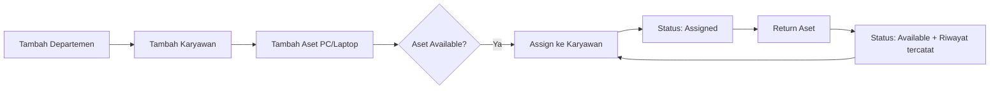

# 01 — Overview & Ruang Lingkup

## 1. Latar Belakang

Pencatatan inventaris komputer (PC/Laptop) saat ini masih menggunakan Excel. Cara ini menimbulkan beberapa masalah:

- Rentan human error, terutama duplikasi **IP Address** dan **MAC Address**.
- Data mudah hilang atau tidak konsisten antar file.
- Sulit melacak riwayat kepemilikan aset (siapa memakai apa, sejak kapan).

## 2. Tujuan

Membangun aplikasi web CRUD sederhana berbasis Laravel untuk:

1. **Sentralisasi data** aset IT dalam satu database.
2. **Validasi otomatis** untuk mencegah duplikasi MAC/IP dan format yang salah.
3. **Tracking alokasi aset** dari IT ke karyawan dan sebaliknya (ujung ke ujung).

## 3. Target Pengguna (User Personas)

| Persona | Deskripsi | Hak Akses |
| --- | --- | --- |
| **Admin IT** (utama) | Mengelola seluruh data | Penuh: CRUD departemen, karyawan, aset, assign/unassign |
| **Viewer / Manager** (opsional) | Melihat dashboard & laporan | Read-only (dashboard & daftar aset per departemen) |

> Untuk MVP, fokus utama adalah **Admin IT**. Role Viewer disiapkan di struktur data tetapi UI-nya boleh disederhanakan.

## 4. Ruang Lingkup

### Termasuk (In Scope)

- Aset berupa **Komputer**: PC dan Laptop.
- Alokasi aset ke karyawan.
- Master data: Departemen dan Karyawan.
- Riwayat pemakaian aset (history).
- **Manajemen komponen (part)**: CPU, RAM, storage, GPU, motherboard, PSU, casing, monitor,
  keyboard, mouse — sebagai aset tersendiri yang bisa dipasang/dilepas dan dilacak
  perpindahannya antarmesin. Lihat [14-manajemen-komponen.md](14-manajemen-komponen.md).

### Tidak Termasuk (Out of Scope)

- Ticketing / perbaikan.
- Depresiasi harga & akuntansi.
- Pencatatan aksesori habis pakai / consumables (tinta printer, kabel, thermal paste).
- Validasi kompatibilitas komponen otomatis (DDR4 vs DDR5, socket CPU).
- Barcode/QR label komponen.
- Integrasi jaringan otomatis (scanning network).
- Multi-cabang / multi-tenant.

> **Catatan revisi.** Awalnya komponen hanya dicatat sebagai field spesifikasi
> (tidak dilacak perpindahannya). Lingkup diperluas agar komponen menjadi aset
> tersendiri dengan riwayat pemasangan. Rasionalnya di
> [06-manajemen-aset.md](06-manajemen-aset.md) §11.

## 5. Alur Bisnis Utama

## 6. Status Aset

| Status | Arti |
| --- | --- |
| `Available` | Aset siap dipakai, belum dialokasikan |
| `Assigned` | Sedang dipakai karyawan |
| `In Repair` | Sedang diperbaiki |
| `Retired` | Tidak dipakai lagi / dihapus dari operasional |

## 7. Glosarium

| Istilah | Arti |
| --- | --- |
| Aset | Unit komputer (PC/Laptop) yang tercatat |
| Assignment | Rekaman penugasan aset ke karyawan |
| Assign | Menugaskan aset ke karyawan |
| Return | Menarik aset dari karyawan kembali ke IT |
| MAC Address | Alamat fisik network interface, harus unik |
| IP Address | Alamat jaringan, opsional tetapi unik jika diisi |
| NIP | Nomor Induk Pegawai |
| Host | Aset PC/Laptop sebagai tempat komponen dipasang |
| Komponen | Part fisik (RAM, GPU, monitor, …) yang menjadi aset tersendiri |
| Pemasangan | Rekaman komponen terpasang pada sebuah host untuk rentang waktu tertentu |
| In Stock | Komponen ada di gudang IT, belum terpasang |
| Installed | Komponen sedang terpasang di sebuah host |

## 8. Referensi

- PRD asli: Sistem Manajemen Aset IT (ITAM) Internal, Fase MVP.
- Dokumen lanjutan: [02-arsitektur.md](02-arsitektur.md), [03-database.md](03-database.md).
