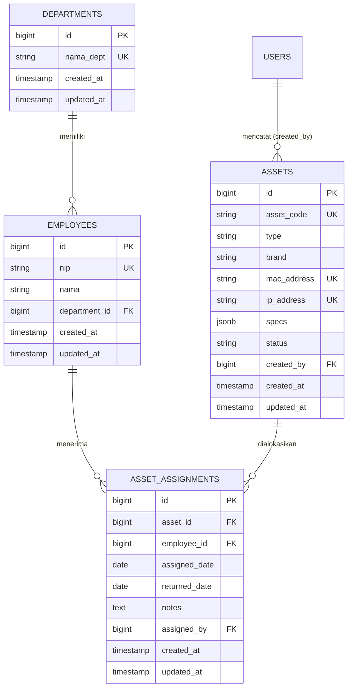

# 03 — Desain Database

Database: **PostgreSQL**. Semua nama tabel plural snake_case, semua primary key `id` bigint auto increment, dan semua tabel transaksional memakai `created_at` / `updated_at`.

## 1. ERD



## 2. Tabel `departments`

| Kolom | Tipe | Constraint | Keterangan |
| --- | --- | --- | --- |
| `id` | bigserial | PK | |
| `nama_dept` | varchar(100) | NOT NULL, UNIQUE | Contoh: EDP, HRGA, EP, RnD, CC |
| `created_at` | timestamp | nullable | |
| `updated_at` | timestamp | nullable | |

Data awal (seeder): `EDP`, `HRGA`, `EP`, `RnD`, `CC`.

```php
Schema::create('departments', function (Blueprint $table) {
    $table->id();
    $table->string('nama_dept', 100)->unique();
    $table->timestamps();
});
```

## 3. Tabel `employees`

| Kolom | Tipe | Constraint | Keterangan |
| --- | --- | --- | --- |
| `id` | bigserial | PK | |
| `nip` | varchar(30) | NOT NULL, UNIQUE | Nomor Induk Pegawai (User ID) |
| `nama` | varchar(150) | NOT NULL | Index untuk pencarian |
| `department_id` | bigint | FK → `departments.id`, `restrictOnDelete` | Tidak boleh dihapus jika masih dipakai |
| `created_at` / `updated_at` | timestamp | nullable | |

```php
Schema::create('employees', function (Blueprint $table) {
    $table->id();
    $table->string('nip', 30)->unique();
    $table->string('nama', 150);
    $table->foreignId('department_id')->constrained('departments')->restrictOnDelete();
    $table->timestamps();
    $table->index('nama');
});
```

## 4. Tabel `assets`

| Kolom | Tipe | Constraint | Keterangan |
| --- | --- | --- | --- |
| `id` | bigserial | PK | |
| `asset_code` | varchar(30) | NOT NULL, UNIQUE | **Selalu dibuat sistem** (tidak diisi manual) |
| `type` | varchar(10) | NOT NULL, CHECK (`PC`,`Laptop`) | Jenis aset |
| `brand` | varchar(100) | NOT NULL | Merek & model, contoh: Dell OptiPlex 7090 |
| `hostname` | varchar(63) | UNIQUE (parsial), nullable | Nama komputer di jaringan/Windows, disimpan lowercase |
| `mac_address` | varchar(17) | NOT NULL, UNIQUE | Format `AA:BB:CC:DD:EE:FF` |
| `ip_address` | varchar(45) | UNIQUE, nullable | IPv4/IPv6, unik jika diisi |
| `specs` | jsonb | NOT NULL, default `{}` | Komponen komputer — lihat tabel di bawah |
| `status` | varchar(20) | NOT NULL, default `Available` | CHECK 4 nilai status |
| `created_by` | bigint | FK → `users.id`, `nullOnDelete` | Audit pembuat (opsional) |
| `deleted_at` | timestamp | nullable | **Soft delete** — data tidak benar-benar hilang |
| `created_at` / `updated_at` | timestamp | nullable | |

### Key di dalam `specs` (jsonb)

Komponen disimpan sebagai key di dalam JSON, **bukan tabel terpisah** (lihat keputusan desain di [06-manajemen-aset.md](06-manajemen-aset.md) §10).

| Key | Label tampilan | Wajib |
| --- | --- | --- |
| `cpu` | CPU | ✅ |
| `ram` | RAM | — |
| `storage` | Storage 1 | — |
| `storage_2` | Storage 2 | — |
| `gpu` | GPU | — |
| `motherboard` | Motherboard | — |
| `psu` | Power Supply | — |
| `casing` | Casing | — |
| `os` | Sistem Operasi | — |
| `monitor` | Monitor | — |
| `keyboard` | Keyboard | — |
| `mouse` | Mouse | — |

Daftar key ini didefinisikan di `Asset::SPEC_KEYS` dan `Asset::specLabels()`. **Menambah komponen baru cukup menambah satu entri di sana** — tanpa migrasi, karena `specs` bertipe `jsonb`.

Contoh isi:

```json
{
  "cpu": "Intel Core i5-10400",
  "ram": "16GB (2x8GB) DDR4",
  "storage": "512GB NVMe SSD",
  "storage_2": "1TB HDD",
  "gpu": "NVIDIA GTX 1650 4GB",
  "motherboard": "ASUS H510M-E",
  "psu": "500W 80+ Bronze",
  "casing": "ATX Mid Tower",
  "os": "Windows 11 Pro 64-bit",
  "monitor": "Dell P2219H 22\"",
  "keyboard": "Logitech K120",
  "mouse": "Logitech B100"
}
```

```php
Schema::create('assets', function (Blueprint $table) {
    $table->id();
    $table->string('asset_code', 30);
    $table->string('type', 10);
    $table->string('brand', 100);
    $table->string('hostname', 63)->nullable();
    $table->string('mac_address', 17);
    $table->string('ip_address', 45)->nullable();
    $table->jsonb('specs')->default('{}');
    $table->string('status', 20)->default('Available');
    $table->foreignId('created_by')->nullable()->constrained('users')->nullOnDelete();
    $table->softDeletes();
    $table->timestamps();

    $table->index('status');
    $table->index('type');
});

// Unique index partial: hanya berlaku untuk baris yang belum di-soft delete.
// Dengan begitu MAC/IP bisa dipakai ulang setelah aset lama dihapus (soft).
DB::statement('CREATE UNIQUE INDEX assets_asset_code_unique
    ON assets (asset_code) WHERE deleted_at IS NULL');
DB::statement('CREATE UNIQUE INDEX assets_mac_address_unique
    ON assets (mac_address) WHERE deleted_at IS NULL');
DB::statement('CREATE UNIQUE INDEX assets_ip_address_unique
    ON assets (ip_address) WHERE deleted_at IS NULL AND ip_address IS NOT NULL');
DB::statement('CREATE UNIQUE INDEX assets_hostname_unique
    ON assets (hostname) WHERE deleted_at IS NULL AND hostname IS NOT NULL');
```

Aturan penting PostgreSQL:

- `UNIQUE` pada kolom nullable **mengizinkan banyak `NULL`**, sehingga IP opsional aman.
- Karena memakai **soft delete**, unique index dibuat **partial** (`WHERE deleted_at IS NULL`) agar aset yang sudah dihapus tidak memblokir penggunaan ulang MAC/IP. Ini juga membuat filter `ip_address IS NOT NULL` pada index IP menjadi eksplisit.

### Implikasi `asset_code` yang Unique Parsial

Perhatikan konsekuensi berbeda antara `asset_code` dengan `mac_address`/`ip_address`:

| Kolom | Unique parsial berarti |
| --- | --- |
| `mac_address`, `ip_address` | **Diinginkan** — perangkat fisik boleh dipakai ulang setelah aset lama dihapus |
| `hostname` | **Diinginkan** — nama komputer boleh dipakai ulang setelah PC lama dihapus |
| `asset_code` | **Perlu kehati-hatian** — kode aset adalah identitas; aset baru tidak boleh mewarisi kode aset terhapus |

Karena itu `AssetCodeGenerator` (lihat [06-manajemen-aset.md](06-manajemen-aset.md) §2) **wajib memakai `withTrashed()`** saat mencari nomor urut terakhir. Jika hanya menghitung baris aktif, generator bisa menerbitkan `asset_code` yang sama dengan aset yang sudah di-soft delete dan menimbulkan kebingungan pada laporan serta audit.

## 5. Tabel `asset_assignments`

Tabel ini adalah **log riwayat**. Satu baris = satu periode pemakaian.

| Kolom | Tipe | Constraint | Keterangan |
| --- | --- | --- | --- |
| `id` | bigserial | PK | |
| `asset_id` | bigint | FK → `assets.id`, `cascadeOnDelete` | |
| `employee_id` | bigint | FK → `employees.id`, `restrictOnDelete` | |
| `assigned_date` | date | NOT NULL | Tanggal mulai |
| `returned_date` | date | nullable | `NULL` = masih dipakai |
| `notes` | text | nullable | Catatan kondisi/kelengkapan |
| `assigned_by` | bigint | FK → `users.id`, `nullOnDelete` | Admin yang memproses |
| `created_at` / `updated_at` | timestamp | nullable | |

```php
Schema::create('asset_assignments', function (Blueprint $table) {
    $table->id();
    $table->foreignId('asset_id')->constrained('assets')->cascadeOnDelete();
    $table->foreignId('employee_id')->constrained('employees')->restrictOnDelete();
    $table->date('assigned_date');
    $table->date('returned_date')->nullable();
    $table->text('notes')->nullable();
    $table->foreignId('assigned_by')->nullable()->constrained('users')->nullOnDelete();
    $table->timestamps();

    $table->index(['asset_id', 'returned_date']);
});
```

### Invariant yang harus dijaga aplikasi

> Satu aset hanya boleh punya **maksimal satu** assignment aktif (`returned_date IS NULL`).

Implementasi: partial unique index di PostgreSQL.

```php
DB::statement('CREATE UNIQUE INDEX one_active_assignment_per_asset
    ON asset_assignments (asset_id) WHERE returned_date IS NULL;');
```

## 6. tabel `users` (modifikasi)

Tambahkan `role` pada migrasi users atau migrasi terpisah:

```php
// database/migrations/xxxx_add_role_to_users_table.php
Schema::table('users', function (Blueprint $table) {
    // Default 'viewer' = least privilege. Akun baru TIDAK boleh otomatis Admin.
    $table->string('role', 20)->default('viewer')->after('password');
    $table->index('role');
});
```

### Keamanan Kolom `role`

- `role` **tidak dimasukkan ke `$fillable`** pada model `User`, sehingga tidak bisa dinaikkan lewat mass assignment (mis. body request registrasi berisi `role=admin`).
- Pemberian role hanya lewat jalur server-side terkontrol: `User::assignRole()` (memakai `forceFill`) atau seeder.
- Registrasi publik dimatikan; akun dibuat oleh Admin IT. Lihat [04-autentikasi.md](04-autentikasi.md) §2.

## 7. CHECK Constraints (PostgreSQL)

```php
DB::statement("ALTER TABLE assets ADD CONSTRAINT assets_type_check
    CHECK (type IN ('PC','Laptop'))");

DB::statement("ALTER TABLE assets ADD CONSTRAINT assets_status_check
    CHECK (status IN ('Available','Assigned','In Repair','Retired'))");

DB::statement("ALTER TABLE users ADD CONSTRAINT users_role_check
    CHECK (role IN ('admin','viewer'))");

DB::statement("ALTER TABLE asset_assignments ADD CONSTRAINT assignment_date_check
    CHECK (returned_date IS NULL OR returned_date >= assigned_date)");
```

> **Catatan implementasi:** enum **tidak dibuat sebagai PostgreSQL `ENUM type`**, melainkan `varchar` + `CHECK constraint`. Alasannya: mengubah nilai enum PostgreSQL menuntut `ALTER TYPE ... ADD VALUE` yang tidak bisa dijalankan di dalam transaksi, sementara `CHECK` mudah di-`DROP`/re-create. Casting enum dilakukan di sisi Laravel (`App\Enums\*`) sehingga aplikasi tetap type-safe.

## 8. Ringkasan Index

| Tabel | Kolom | Tipe | Alasan |
| --- | --- | --- | --- |
| `departments` | `nama_dept` | UNIQUE | Cegah duplikasi nama |
| `employees` | `nip` | UNIQUE | Identitas unik karyawan |
| `employees` | `nama` | B-TREE | Pencarian nama |
| `employees` | `department_id` | FK index | Filter per departemen |
| `assets` | `asset_code` | UNIQUE PARTIAL (`deleted_at IS NULL`) | Kode aset unik antar aset aktif |
| `assets` | `hostname` | UNIQUE PARTIAL (`deleted_at IS NULL AND hostname IS NOT NULL`) | Nama komputer unik antar aset aktif |
| `assets` | `mac_address` | UNIQUE PARTIAL (`deleted_at IS NULL`) | **Validasi duplikasi MAC** |
| `assets` | `ip_address` | UNIQUE PARTIAL (`deleted_at IS NULL AND ip_address IS NOT NULL`) | **Validasi duplikasi IP** |
| `assets` | `status`, `type` | B-TREE | Filter dashboard |
| `asset_assignments` | `(asset_id, returned_date)` | COMPOSITE | Query assignment aktif & riwayat |
| `asset_assignments` | `asset_id` WHERE `returned_date IS NULL` | UNIQUE PARTIAL | Satu assignment aktif per aset |
| `asset_assignments` | `(employee_id, returned_date)` | COMPOSITE | Hitung aset aktif per departemen (dashboard) |
| `asset_assignments` | `(assigned_date, id)` | COMPOSITE | Daftar alokasi terbaru (ORDER BY ... LIMIT) |

## 9. Urutan Migrasi

1. `2014_10_12_000000_create_users_table.php` (sudah ada)
2. `2026_01_01_000001_add_role_to_users_table.php`
3. `2026_01_01_000002_create_departments_table.php`
4. `2026_01_01_000003_create_employees_table.php`
5. `2026_01_01_000004_create_assets_table.php`
6. `2026_01_01_000005_create_asset_assignments_table.php`
7. `2026_01_01_000006_add_dashboard_indexes_to_asset_assignments_table.php`
8. `2026_01_01_000007_add_hostname_to_assets_table.php`

## 10. Cast Model (Target)

```php
// Asset.php
protected $casts = [
    'specs'  => 'array',
    'type'   => AssetType::class,
    'status' => AssetStatus::class,
];

// Asset.php — soft delete
use Illuminate\Database\Eloquent\SoftDeletes;

class Asset extends Model
{
    use SoftDeletes;
}

// AssetAssignment.php
protected $casts = [
    'assigned_date' => 'date',
    'returned_date' => 'date',
];
```

### Implikasi Soft Delete pada Validasi Unique

Karena `assets` memakai soft delete, aturan `Rule::unique()` pada Form Request **harus dibatasi ke baris yang belum dihapus**, agar konsisten dengan partial index:

```php
Rule::unique('assets', 'mac_address')->whereNull('deleted_at')
```

Jika tidak, validasi aplikasi akan menolak MAC yang sebenarnya sudah bebas karena aset lamanya telah dihapus.

### Kebijakan Restore

- Aset yang di-soft delete tetap muncul di laporan khusus (filter "Termasuk yang dihapus").
- Restore (`restore()`) harus memvalidasi ulang konflik `asset_code`, `mac_address`, dan `ip_address`: jika salah satunya sudah dipakai aset aktif lain, restore ditolak dengan pesan jelas. (`asset_code` wajib dicek karena unique index-nya juga parsial.)
- `asset_assignments` **tidak** memakai soft delete (append-only); barisnya ikut tetap ada karena FK `cascadeOnDelete` hanya terpicu oleh hard delete.

## 11. Relasi Tambahan

Selain relasi dasar, `Department` memiliki relasi `hasManyThrough` untuk menghitung alokasi aset per departemen (dipakai dashboard):

```php
// app/Models/Department.php
public function assignments(): HasManyThrough
{
    return $this->hasManyThrough(
        AssetAssignment::class,
        Employee::class,
        'department_id',   // FK di employees
        'employee_id',     // FK di asset_assignments
        'id',              // local key di departments
        'id'               // local key di employees
    );
}
```

Dengan relasi ini, `withCount(['assignments as assigned_assets_count' => fn ($q) => $q->whereNull('returned_date')])` menghitung **baris assignment aktif** per departemen — bukan jumlah karyawan, yang bisa berbeda bila satu karyawan memegang lebih dari satu aset.
