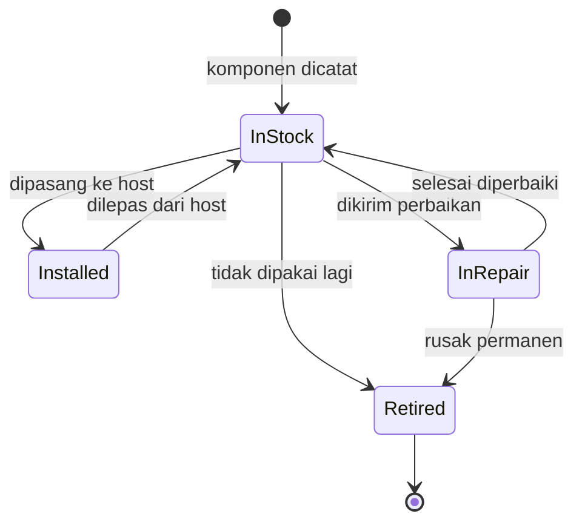

# 14 — Manajemen Komponen (Part sebagai Aset)

> **Status:** ✅ **SUDAH DIIMPLEMENTASIKAN.**
> **Fase:** 2 (perluasan di luar MVP). Lihat [12-acceptance-dan-roadmap.md](12-acceptance-dan-roadmap.md) §6b.

## 1. Latar Belakang & Tujuan

Pada desain awal, komponen PC (CPU, RAM, storage, GPU, dst.) dicatat sebagai key di dalam
kolom `assets.specs` (Model A). Cara itu menjawab pertanyaan *"PC ini isinya apa?"*, tetapi
**tidak** menjawab *"keping RAM ini sekarang ada di mana, dan sebelumnya di mana saja?"*.

Kebutuhan nyata: komponen dipindah antarmesin (upgrade, kanibalisasi PC rusak, mutasi),
dan perpindahan itu harus terekam rapi.

**Tujuan:**

1. Setiap komponen fisik menjadi **aset tersendiri** yang bisa dilacak.
2. Terekam **riwayat pemasangan**: komponen X pernah di PC A (tanggal …), lalu pindah ke PC B.
3. Hubungan PC ↔ komponen terlihat jelas, dan tetap bisa disimpulkan siapa yang pernah
   memakai komponen tersebut (lewat riwayat alokasi PC ke karyawan).

## 2. Konsep & Istilah

| Istilah | Arti |
| --- | --- |
| **Host** | Aset utama tempat komponen dipasang: **PC** atau **Laptop** (tabel `assets`) |
| **Komponen** | Part fisik yang bisa dipasang/ dilepas (tabel `components`) |
| **Pemasangan** | Rekaman komponen terpasang pada sebuah host untuk rentang waktu tertentu |
| **In Stock** | Komponen ada di gudang IT, belum terpasang |
| **Installed** | Komponen sedang terpasang di sebuah host |

Komponen **adalah aset** secara konsep: punya kode, merek, nomor seri, status, dan riwayat.
Secara teknis ia disimpan di tabel terpisah karena atributnya berbeda dari host.

### Mengapa tabel terpisah, bukan satu tabel `assets`?

| Alasan | Penjelasan |
| --- | --- |
| Atribut berbeda | Komponen tidak punya `mac_address`, `ip_address`, `hostname` |
| Constraint host tetap kuat | `mac_address` host tetap `NOT NULL UNIQUE`; tidak perlu dilonggarkan |
| UI berbeda | Daftar host butuh kolom pemegang & MAC; daftar komponen butuh kolom lokasi & serial |
| Riwayat berbeda | Host → karyawan (`asset_assignments`); komponen → host (`component_installations`) |

## 3. Kategori Komponen

| Kategori | Label | Jenis | Prefix kode | Contoh atribut di `specs` |
| --- | --- | --- | --- | --- |
| `cpu` | CPU | Internal | `CPU` | `socket`, `cores`, `threads` |
| `ram` | RAM | Internal | `RAM` | `capacity`, `type`, `speed` |
| `storage` | Storage | Internal | `DSK` | `capacity`, `type`, `interface` |
| `gpu` | GPU | Internal | `GPU` | `memory`, `memory_type` |
| `motherboard` | Motherboard | Internal | `MBD` | `socket`, `form_factor` |
| `psu` | Power Supply | Internal | `PSU` | `wattage`, `efficiency` |
| `casing` | Casing | Internal | `CSG` | `form_factor` |
| `monitor` | Monitor | Peripheral | `MON` | `size`, `resolution` |
| `keyboard` | Keyboard | Peripheral | `KBD` | `connection` |
| `mouse` | Mouse | Peripheral | `MSE` | `connection` |
| `other` | Lainnya | — | `CMP` | bebas |

- **Internal** = dipasang **di dalam** host. **Peripheral** = terhubung ke host (boleh berpindah sendiri).
- Keduanya memakai mekanisme pemasangan yang sama; bedanya hanya pada pengelompokan tampilan.
- **OS bukan komponen** karena bukan benda fisik. OS tetap atribut host (lihat §9).
- `other` disediakan untuk kategori yang belum terdaftar (docking station, UPS, headset, webcam).

### 3.1 Atribut `specs` per Kategori

Key di `components.specs` mengikuti kategori, sehingga form dapat menampilkan field yang relevan:

| Kategori | Key atribut | Contoh nilai |
| --- | --- | --- |
| `cpu` | `socket`, `cores`, `threads`, `base_clock` | `LGA1200`, `6`, `12`, `2.9GHz` |
| `ram` | `capacity`, `type`, `speed`, `module` | `8GB`, `DDR4`, `3200MHz`, `SODIMM` |
| `storage` | `capacity`, `type`, `interface` | `512GB`, `SSD`, `NVMe` |
| `gpu` | `memory`, `memory_type`, `interface` | `4GB`, `GDDR6`, `PCIe 4.0 x16` |
| `motherboard` | `socket`, `form_factor`, `chipset` | `LGA1200`, `micro-ATX`, `H510` |
| `psu` | `wattage`, `efficiency`, `modular` | `500W`, `80+ Bronze`, `Non-modular` |
| `casing` | `form_factor`, `bay` | `ATX Mid Tower`, `2x3.5"` |
| `monitor` | `size`, `resolution`, `panel` | `24"`, `1920x1080`, `IPS` |
| `keyboard` | `connection`, `layout` | `USB`, `QWERTY` |
| `mouse` | `connection`, `dpi` | `USB`, `1000` |
| `other` | bebas | — |

> Daftar di atas adalah acuan tampilan form, bukan batasan database. Karena `specs`
> bertipe `jsonb`, penambahan key cukup diubah di konfigurasi kategori — **tanpa migrasi**.

## 4. Skema Database

### 4.1 Tabel `components`

| Kolom | Tipe | Constraint | Keterangan |
| --- | --- | --- | --- |
| `id` | bigserial | PK | |
| `component_code` | varchar(30) | NOT NULL, UNIQUE (parsial) | Dibuat sistem, contoh `RAM-2026-0001` |
| `category` | varchar(20) | NOT NULL, CHECK | Salah satu dari §3 |
| `brand` | varchar(100) | NOT NULL | Merek, contoh `Kingston` |
| `model` | varchar(150) | nullable | Model, contoh `Fury Beast DDR4` |
| `serial_number` | varchar(100) | UNIQUE (parsial), nullable | Nomor seri fisik bila ada |
| `specs` | jsonb | NOT NULL, default `{}` | Atribut khas kategori (§3) |
| `status` | varchar(20) | NOT NULL, default `In Stock` | CHECK 4 nilai |
| `notes` | text | nullable | Catatan kondisi |
| `created_by` | bigint | FK → `users.id`, `nullOnDelete` | Audit |
| `deleted_at` | timestamp | nullable | Soft delete |
| `created_at` / `updated_at` | timestamp | nullable | |

```php
Schema::create('components', function (Blueprint $table) {
    $table->id();
    $table->string('component_code', 30);
    $table->string('category', 20);
    $table->string('brand', 100);
    $table->string('model', 150)->nullable();
    $table->string('serial_number', 100)->nullable();
    $table->jsonb('specs')->default('{}');
    $table->string('status', 20)->default('In Stock');
    $table->text('notes')->nullable();
    $table->foreignId('created_by')->nullable()->constrained('users')->nullOnDelete();
    $table->softDeletes();
    $table->timestamps();

    $table->index('category');
    $table->index('status');
});

DB::statement('CREATE UNIQUE INDEX components_component_code_unique
    ON components (component_code) WHERE deleted_at IS NULL');
DB::statement('CREATE UNIQUE INDEX components_serial_number_unique
    ON components (serial_number) WHERE deleted_at IS NULL AND serial_number IS NOT NULL');

DB::statement("ALTER TABLE components ADD CONSTRAINT components_category_check
    CHECK (category IN ('cpu','ram','storage','gpu','motherboard','psu','casing','monitor','keyboard','mouse','other'))");
DB::statement("ALTER TABLE components ADD CONSTRAINT components_status_check
    CHECK (status IN ('In Stock','Installed','In Repair','Retired'))");
```

### 4.2 Tabel `component_installations`

Satu baris = satu periode pemasangan komponen pada sebuah host.

| Kolom | Tipe | Constraint | Keterangan |
| --- | --- | --- | --- |
| `id` | bigserial | PK | |
| `component_id` | bigint | FK → `components.id`, `cascadeOnDelete` | Komponen (subjek riwayat) |
| `asset_id` | bigint | FK → `assets.id`, `restrictOnDelete` | Host tempat dipasang |
| `installed_date` | date | NOT NULL | Tanggal pasang |
| `removed_date` | date | nullable | `NULL` = masih terpasang |
| `notes` | text | nullable | Alasan pasang/lepas, kondisi |
| `installed_by` | bigint | FK → `users.id`, `nullOnDelete` | Admin yang memproses |
| `created_at` / `updated_at` | timestamp | nullable | |

```php
Schema::create('component_installations', function (Blueprint $table) {
    $table->id();
    $table->foreignId('component_id')->constrained('components')->cascadeOnDelete();
    $table->foreignId('asset_id')->constrained('assets')->restrictOnDelete();
    $table->date('installed_date');
    $table->date('removed_date')->nullable();
    $table->text('notes')->nullable();
    $table->foreignId('installed_by')->nullable()->constrained('users')->nullOnDelete();
    $table->timestamps();

    $table->index(['asset_id', 'removed_date']);
    $table->index(['component_id', 'removed_date']);
});

// Satu komponen hanya boleh terpasang di SATU host pada satu waktu.
DB::statement('CREATE UNIQUE INDEX one_active_install_per_component
    ON component_installations (component_id) WHERE removed_date IS NULL');

DB::statement('ALTER TABLE component_installations ADD CONSTRAINT component_install_date_check
    CHECK (removed_date IS NULL OR removed_date >= installed_date)');
```

### 4.3 Aturan Foreign Key (mengapa berbeda)

| FK | Aksi | Alasan |
| --- | --- | --- |
| `component_installations.component_id` | `cascadeOnDelete` | Komponen adalah **subjek** riwayat; riwayat tidak bermakna tanpa komponennya |
| `component_installations.asset_id` | `restrictOnDelete` | Host adalah **konteks**; kode PC harus tetap terekam, jadi PC berkomponen tidak boleh di-hard-delete |
| `components.created_by`, `component_installations.installed_by` | `nullOnDelete` | Audit, bukan relasi bisnis |

## 5. Kode Komponen

Format sama seperti aset host: `{PREFIX}-{TAHUN}-{URUT 4 DIGIT}`, prefix per kategori (§3).

Contoh: `RAM-2026-0001`, `DSK-2026-0002`, `MON-2026-0001`.

- Dibuat **selalu otomatis** oleh sistem; form tidak menerima input kode.
- Urutan dihitung **per (prefix, tahun)**, dan **memakai `withTrashed()`** agar kode komponen
  yang sudah dihapus tidak diterbitkan ulang.
- Penguncian memakai `pg_advisory_xact_lock` di dalam transaksi, sama seperti
  [AssetCodeGenerator](../app/Services/AssetCodeGenerator.php).

**Rencana implementasi:** generalisasi `AssetCodeGenerator` menjadi `CodeGenerator`
yang menerima (tabel, prefix) agar tidak ada logika urutan yang terduplikasi.

## 6. Siklus Hidup & Status



| Status | Arti |
| --- | --- |
| `In Stock` | Ada di gudang IT, siap dipasang |
| `Installed` | Sedang terpasang di sebuah host |
| `In Repair` | Sedang diperbaiki |
| `Retired` | Tidak dipakai lagi |

Status `Installed` **hanya** boleh diubah oleh proses pasang/lepas, bukan diedit manual —
analog dengan aturan `Assigned` pada aset host ([10-validasi.md](10-validasi.md) §6).

## 7. Aturan Bisnis

| No | Aturan |
| --- | --- |
| K1 | Satu komponen maksimal terpasang di **satu** host pada satu waktu (partial unique index). |
| K2 | Pemasangan hanya boleh untuk komponen berstatus `In Stock`. |
| K3 | Komponen `In Repair` dan `Retired` **tidak boleh** dipasang. |
| K4 | Pelepasan mengisi `removed_date` dan mengubah status komponen kembali ke `In Stock`. |
| K5 | `removed_date` tidak boleh lebih awal dari `installed_date` (CHECK). |
| K6 | Memindahkan komponen dari host A ke host B = **lepas + pasang** (dua baris riwayat), bukan mengubah baris lama. |
| K7 | Riwayat pemasangan bersifat **append-only**; koreksi dilakukan dengan lepas lalu pasang ulang. |
| K8 | Komponen yang punya riwayat pemasangan **tidak boleh dihapus permanen** (audit). Soft delete tetap boleh. |
| K9 | Host yang masih punya komponen terpasang **tidak boleh dihapus permanen**; komponen harus dilepas lebih dulu. |
| K10 | Pemasangan/pelepasan boleh dilakukan walau host sedang dipegang karyawan (upgrade di tempat). Pelaku dicatat di `installed_by`. |
| K11 | Masa pakai komponen tidak boleh melebihi masa pakai host: tanggal pasang tidak boleh sebelum host dibuat. |

> **Catatan K10:** tidak ada aturan yang memaksa host harus `In Repair` saat komponen diganti,
> karena praktiknya IT melakukan upgrade saat PC tetap dipakai.

## 8. Riwayat & Keterkaitan dengan Alokasi Host

Ada dua lapis riwayat yang saling melengkapi:

```
Karyawan  ←── asset_assignments ──→  Host (PC)  ←── component_installations ──→  Komponen
```

- **Riwayat komponen** menjawab: "RAM ini pernah ada di PC mana saja".
- **Riwayat alokasi host** menjawab: "PC ini pernah dipegang siapa saja".
- **Gabungan keduanya** menyimpulkan: "RAM ini pernah dipakai Budi, karena saat itu RAM
  terpasang di PC-001 yang sedang dipegang Budi".

Kesimpulan gabungan ini **dihitung**, tidak disimpan, agar tidak ada data ganda yang bisa
menyimpang. Halaman detail komponen menampilkan tabel pemasangan; kolom pemakai bersifat
turunan (opsional, dihitung dari rentang tanggal yang beririsan).

## 9. Perubahan pada Modul Aset

`assets.specs` **disederhanakan** menjadi atribut non-part saja:

| Sebelum | Sesudah |
| --- | --- |
| `cpu`, `ram`, `storage`, `storage_2`, `gpu`, `motherboard`, `psu`, `casing`, `os`, `monitor`, `keyboard`, `mouse` | **`os`** saja (perangkat lunak, bukan benda fisik) |

- Part fisik **dihapus** dari `Asset::SPEC_KEYS`; pengelolaannya pindah ke modul komponen.
- **Ringkasan perangkat keras** PC (contoh: `i7-11700 · 32GB (2x8GB) · 1TB SSD`) **dihitung
  otomatis** dari komponen yang terpasang, bukan disimpan sebagai kolom.
- Untuk halaman daftar, komponen terpasang di-*eager load* sekali per halaman sehingga tidak
  memicu N+1.
- Form aset tidak lagi punya 12 field spesifikasi; cukup field **OS**. Komponen ditambahkan
  dari halaman detail aset setelah aset dibuat.

> **Konsekuensi yang perlu disadari:** bila komponen belum diinput, ringkasan perangkat keras
> akan kosong. Ini disengaja — data part hanya valid bila benar-benar dicatat.

## 10. Migrasi Data dari `specs` Lama

Data `specs` lama **tidak dapat dipisah** menjadi keping fisik: nilai seperti
`"16GB (2x8GB) DDR4"` tidak memberi tahu ada berapa keping dan nomor serinya.

Karena itu:

1. **Migrasi otomatis tidak dilakukan** di dalam migration. Tidak ada pemaksaan tebak-tebakan data.
2. Disediakan perintah manual **`php artisan components:import-from-specs --dry-run`** yang:
   - membaca `assets.specs` lama,
   - membuat **satu** komponen per key (bukan per keping),
   - menandainya di `notes` sebagai "hasil impor, perlu diverifikasi",
   - melewati key `os`.
3. Setelah impor, admin memverifikasi/memecah komponen sesuai keping fisik sebenarnya.
4. `specs` lama **tidak dihapus** sampai impor terverifikasi (disimpan sebagai cadangan).

> Perintah ini bersifat bantu-migrasi untuk data development/lama, bukan bagian alur normal.

## 11. UI/UX

| Halaman | Isi |
| --- | --- |
| **Komponen** (`components.index`) | Tabel: kode, kategori, merek/model, serial, **lokasi saat ini** (kode PC atau "Gudang"), status. Filter kategori & status, pencarian kode/serial/merek. |
| **Detail komponen** (`components.show`) | Info komponen + **Riwayat Pemasangan** (host, tanggal pasang, tanggal lepas, durasi, catatan). Tombol **Pasang ke Host / Pindah / Lepas**. |
| **Tambah/Edit komponen** | Form: kategori, merek, model, serial, spesifikasi (field menyesuaikan kategori), status, catatan. |
| **Detail aset** (`assets.show`) | Bagian **"Komponen Terpasang"**: daftar komponen aktif dengan kolom **Aksi** berisi **Pindah** dan **Lepas** per baris, plus tombol **Pasang Komponen**. |
| **Dashboard** | Kartu tambahan: Total Komponen, Komponen di Gudang. |

### Aksi Pelepasan & Pemindahan Tersedia di Dua Tempat

Agar tidak membingungkan, aksi tersedia dari **kedua sisi**:

| Dari | Pindah | Lepas | Pasang |
| --- | --- | --- | --- |
| Detail **aset** (host) | ✅ tautan ke form pindah | ✅ panel inline (tanggal + catatan) | ✅ tombol di header kartu |
| Detail **komponen** | ✅ tombol | ✅ panel inline | ✅ tombol (pilih host) |

Panel **Lepas** memakai Alpine `x-show` di dalam satu `<tbody>` per baris, sehingga tanggal
lepas dan catatan dapat diisi tanpa berpindah halaman.

### Navigasi Kembali Mengikuti Asal Form

Form Pindah & Lepas bisa dibuka dari **dua** tempat. Agar tidak melempar pengguna ke
halaman yang tidak ia harapkan, tujuan kembali mengikuti parameter `from`:

| Dibuka dari | Tujuan tombol Batal / kembali | Setelah aksi berhasil |
| --- | --- | --- |
| Detail **aset** (`?from=asset`) | kembali ke **aset** tersebut | redirect ke **aset** tersebut |
| Detail **komponen** (tanpa `from`) | kembali ke **komponen** | redirect ke **komponen** |

Implementasi: tautan dari detail aset mengirim `?from=asset`, form menyimpan
`<input type="hidden" name="from" value="asset">`, dan controller memilih route tujuan
berdasarkan nilai itu. Tanpa parameter, perilaku default adalah kembali ke detail komponen.

### Alur Memindahkan Komponen ke PC Lain

Ada **dua cara**, keduanya sah:

1. **Pindah (satu langkah)** — tombol *Pindah* → pilih host tujuan. Menghasilkan **dua** baris riwayat dalam satu transaksi (lihat §7 K6).
2. **Lepas lalu Pasang (dua langkah)** — tombol *Lepas* → komponen kembali `In Stock` → lalu *Pasang* ke host lain. Dua baris riwayat terpisah.

Jalur 2 berguna bila komponen sempat masuk gudang dulu sebelum dipasang ke PC berikutnya.

Navigasi sidebar mendapat menu **Komponen** (di bawah Aset).

> **Catatan penamaan folder view.** Halaman komponen disimpan di
> `resources/views/parts/`, **bukan** `resources/views/components/`, karena folder
> terakhir sudah dipakai Blade component (`<x-card>`, `<x-status-badge>`, dst.).
> Nama route/controller/model tetap `components`. Lihat
> [02-arsitektur.md](02-arsitektur.md) §3.

## 12. Route

```php
Route::middleware('auth')->group(function () {
    Route::get('components', [ComponentController::class, 'index'])->name('components.index');
    Route::get('components/{component}', [ComponentController::class, 'show'])
        ->whereNumber('component')->name('components.show');
});

Route::middleware(['auth', 'role:admin'])->group(function () {
    Route::get('components/create', [ComponentController::class, 'create'])->name('components.create');
    Route::post('components', [ComponentController::class, 'store'])->name('components.store');
    Route::get('components/trashed', [ComponentController::class, 'trashed'])->name('components.trashed');
    Route::get('components/{component}/edit', [ComponentController::class, 'edit'])
        ->whereNumber('component')->name('components.edit');
    Route::put('components/{component}', [ComponentController::class, 'update'])
        ->whereNumber('component')->name('components.update');
    Route::delete('components/{component}', [ComponentController::class, 'destroy'])
        ->whereNumber('component')->name('components.destroy');

    // Pemasangan / pelepasan
    Route::get('assets/{asset}/components/install', [ComponentInstallationController::class, 'create'])
        ->whereNumber('asset')->name('components.install.create');
    Route::post('assets/{asset}/components/install', [ComponentInstallationController::class, 'store'])
        ->whereNumber('asset')->name('components.install.store');
    Route::post('installations/{installation}/remove', [ComponentInstallationController::class, 'remove'])
        ->whereNumber('installation')->name('components.remove');
});
```

> Route statis (`components/create`, `components/trashed`) didahulukan, ditambah
> `whereNumber()`, mengikuti pola yang sudah dipakai pada modul aset.

## 13. Service Layer

Semua logika lintas-tabel masuk `ComponentAllocationService` (analog
`AssetAllocationService`), dibungkus `DB::transaction` + `lockForUpdate`:

```php
public function install(Component $component, Asset $asset, Carbon $date, ?string $notes): ComponentInstallation
public function remove(ComponentInstallation $installation, Carbon $date, ?string $notes): ComponentInstallation
public function move(Component $component, Asset $target, Carbon $date, ?string $notes): ComponentInstallation
```

`move()` = `remove()` + `install()` dalam satu transaksi, menghasilkan dua baris riwayat —
sama seperti transfer aset ([07-alokasi-aset.md](07-alokasi-aset.md)).

## 14. Acceptance Criteria

| AC | Kriteria | Status | Test |
| --- | --- | --- | --- |
| AC-5 | Admin menambah komponen RAM; sistem memberi kode `RAM-2026-0001`, status `In Stock`. | ✅ | `ComponentTest` |
| AC-6 | Admin memasang komponen ke PC → status `Installed`, muncul di detail PC, 1 baris riwayat. | ✅ | `ComponentInstallationTest` |
| AC-7 | Admin melepas komponen → status kembali `In Stock`, `removed_date` terisi. | ✅ | `ComponentInstallationTest` |
| AC-8 | Komponen dipindah PC A → PC B → riwayat **dua** baris, lokasi = PC B. | ✅ | `ComponentInstallationTest` |
| AC-9 | Memasang komponen yang sudah terpasang di tempat lain **ditolak**. | ✅ | `ComponentInstallationTest` |
| AC-10 | Memasang komponen `Retired` / `In Repair` **ditolak**. | ✅ | `ComponentInstallationTest` |
| AC-11 | Ringkasan perangkat keras PC berubah sesuai komponen terpasang. | ✅ | `AssetTest` |
| AC-12 | Menghapus PC yang masih punya komponen terpasang **ditolak**. | ✅ | `AssetTest`, `ComponentInstallationTest` |
| AC-13 | Viewer hanya dapat melihat (route tulis → 403). | ✅ | `ComponentTest`, `ComponentInstallationTest` |

## 15. Dampak ke Fitur Lain

| Fitur | Dampak |
| --- | --- |
| CRUD Aset | Form kehilangan field part; `specs` tinggal OS; ringkasan dihitung |
| Hapus permanen aset | Ditambah syarat: tidak ada komponen terpasang |
| Dashboard | Kartu Total Komponen & Komponen di Gudang |
| Pencarian aset | Dapat diperluas mencari nomor seri komponen (lihat batasan) |
| Seeder | `ComponentSeeder` baru (data contoh) |
| Test | Modul komponen punya feature test sendiri + penyesuaian test aset |

## 16. Batasan (Yang TIDAK Termasuk)

- **Tidak** melacak konsumsi/consumable habis pakai (tinta, kabel) — tetap di luar lingkup.
- **Tidak** ada validasi kompatibilitas otomatis (DDR4 vs DDR5, socket CPU vs motherboard).
  Kompatibilitas tetap tanggung jawab admin; sistem hanya mencatat.
- **Tidak** ada barcode/QR label; kode komponen dicetak/ditulis manual bila perlu.
- **Tidak** ada depresiasi nilai komponen.
- **Tidak** menyimpan pemakai karyawan langsung di riwayat komponen (dihitung dari irisan
  tanggal dengan riwayat alokasi host).
- **Tidak** ada pencarian aset berdasarkan serial komponen pada rilis pertama; disiapkan
  sebagai penyempurnaan lanjutan.

## 17. Rencana Implementasi

Semua langkah **selesai** (Fase 2):

| Langkah | Isi | Status |
| --- | --- | --- |
| L1 | Migrasi `components` + `component_installations` + CHECK + partial unique index | ✅ |
| L2 | Enum `ComponentCategory`, `ComponentStatus`; model `Component`, `ComponentInstallation` | ✅ |
| L3 | Generalisasi `AssetCodeGenerator` → `CodeGenerator` (dipakai host & komponen) | ✅ |
| L4 | `ComponentRequest`, `ComponentController` (CRUD + trashed/restore) | ✅ |
| L5 | `ComponentAllocationService` (install/remove/move) + request pemasangan | ✅ |
| L6 | View komponen (`views/parts/`) + bagian di detail aset | ✅ |
| L7 | Sesuaikan modul aset: `specs` → OS saja, ringkasan otomatis, guard hapus | ✅ |
| L8 | `components:import-from-specs` (dry-run) untuk data lama | ✅ |
| L9 | Seeder komponen + penyesuaian seeder aset | ✅ |
| L10 | Feature test (AC-5 … AC-13) + pembaruan dokumentasi | ✅ |

## 18. Catatan Implementasi

Beberapa hal yang berbeda dari desain awal, beserta alasannya:

| Topik | Keputusan |
| --- | --- |
| **Kode komponen** | `CodeGenerator::nextComponent()` memakai `Component::CODE_COLUMN`; `Asset` mendapat `CODE_COLUMN` juga agar logika urutan tunggal. |
| **Folder view** | Halaman komponen di `resources/views/parts/` — `views/components/` sudah dipakai Blade component. |
| **Variabel view** | View komponen memakai `$part`, **bukan** `$component`. Blade memakai variabel internal `$component` saat merender `<x-app-layout>`, sehingga nama itu tidak aman. |
| **Prop badge** | `<x-component-status-badge :value="...">`, bukan `:status="..."` — `$status` juga dipakai Blade/Laravel. |
| **K11 (tanggal pasang vs host dibuat)** | Dibandingkan **per hari** (`startOfDay`), karena `installed_date` bertipe `date` sedangkan `created_at` menyimpan jam. |
| **`specs` aset opsional** | Karena tinggal OS dan OS tidak wajib, rule `specs` diubah dari `required` menjadi `nullable`. |
| **Dua arah pemasangan** | Dari detail aset (`assets/{asset}/components/install`) dan dari detail komponen (`components/{component}/install`). Keduanya memanggil service yang sama. |
| **Import data lama** | Satu komponen per key `specs`, ditandai "PERLU DIVERIFIKASI" di `notes`, melewati `os`. `specs` lama tidak dihapus. |
| **Ringkasan HW di daftar aset** | Dihitung dari komponen terpasang, dengan `activeComponentInstallations.component` di-eager load agar tidak N+1. |
