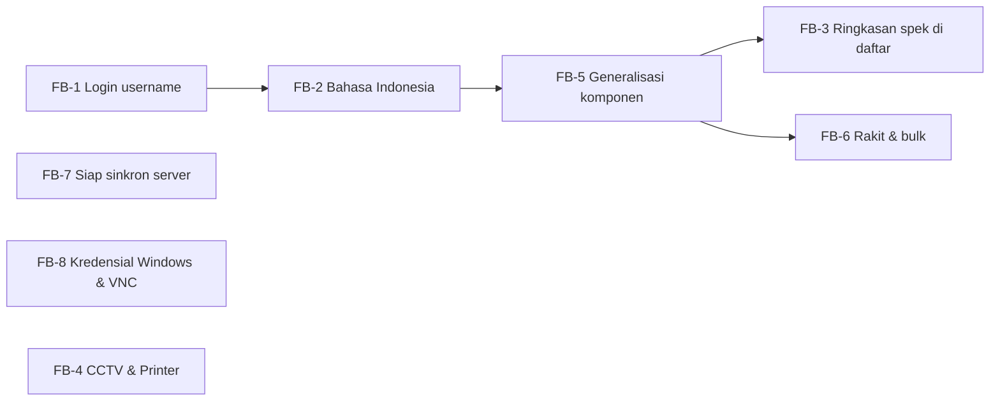

# 15 — Umpan Balik Pengguna & Rencana Tindak Lanjut

Dokumen ini mencatat **umpan balik dari rekan kerja dan pengguna (Admin IT)**, hasil
identifikasi terhadap kondisi sistem saat ini, dan rencana perubahan/penambahan.

> **Status:** ✅ **SUDAH DIIMPLEMENTASIKAN SELURUHNYA** (FB-1 s/d FB-8).
> Setiap poin dipetakan ke kode yang terdampak, tingkat usaha, dan dokumen terkait.

## Keputusan Final (dari pemilik produk)

| # | Keputusan |
| --- | --- |
| FB-1 | **Email dihapus sepenuhnya.** Login memakai **username**. Tidak ada lupa password / verifikasi email. Bila Admin IT lupa password, disediakan **jalur bantuan** (perintah CLI / reset oleh operator). |
| FB-2 | **Semua teks tampil Bahasa Indonesia, termasuk status.** Nilai di database bebas — yang penting tampilan Indonesia. |
| FB-4 | Tambah jenis **CCTV** & **Printer**. **Komponen printer (toner/cartridge) TIDAK dilacak** — itu consumable. **MAC Address opsional** untuk CCTV, dan **tidak diperlukan** untuk Printer. |
| FB-6 | Rakit aset memakai **komponen baru** (pengadaan) **dan/atau komponen yang sudah ada di gudang** (mis. peripheral). Keduanya didukung. |
| FB-7 | Master data departemen & karyawan: **bulk DIBATALKAN**. Cukup **siapkan struktur** agar nanti siap menerima sinkronisasi data dari server. |
| FB-8 | Simpan **informasi akun & password Windows** dan **informasi VNC** per aset, agar Admin IT bisa remote saat ada kendala. |

> **Catatan FB-2:** keputusan "DB bebas" saya terjemahkan menjadi **nilai DB tetap Inggris,
> label tampilan Indonesia**. Alasannya: mengubah nilai di DB menuntut migrasi data + ubah
> `CHECK constraint`, dan berisiko merusak data lama tanpa manfaat nyata — sedangkan
> label-only langsung memenuhi permintaan "yang tampil bahasa Indonesia". Bila Anda ingin
> nilai DB ikut Indonesia, cukup bilang; itu menambah satu langkah migrasi.

## Ringkasan Umpan Balik

| # | Umpan Balik | Kategori | Usaha | Prioritas | Status |
| --- | --- | --- | --- | --- | --- |
| FB-1 | Login pakai **username**, bukan email | Perubahan | Sedang | **Tinggi** | ✅ |
| FB-2 | Bahasa distandarkan **full Bahasa Indonesia** | Perbaikan | Sedang | **Tinggi** | ✅ |
| FB-3 | Ringkasan spesifikasi esensial di **daftar aset** (motherboard, CPU, kapasitas SSD/RAM) | Perbaikan | Sedang | **Tinggi** | ✅ |
| FB-4 | Tambah jenis aset **CCTV** & **Printer** (melekat ke departemen, bisa PIC karyawan) | Penambahan | Besar | **Tinggi** | ✅ |
| FB-5 | **Generalisasi input komponen** — cukup seri/kapasitas/tipe, jangan terlalu banyak field | Perbaikan | Sedang | **Tinggi** | ✅ |
| FB-6 | **Rakit aset**: komponen baru + ambil dari gudang, saat membuat aset | Penambahan | Besar | **Tinggi** | ✅ |
| FB-7 | Master data: **siapkan struktur sinkron server** (bulk dibatalkan) | Perbaikan | Kecil | Sedang | ✅ |
| FB-8 | **Kredensial Windows & VNC** per aset (terenkripsi) | Penambahan | Sedang | **Tinggi** | ✅ |

---

## Temuan Lanjutan (T1–T7)

Umpan balik lanjutan setelah Fase 3 diimplementasikan. **Seluruhnya sudah dikerjakan.**

| # | Temuan | Keputusan | Usaha | Status |
| --- | --- | --- | --- | --- |
| **T1** | CCTV tidak melekat departemen | CCTV **tanpa pemilik** (tanggung jawab Admin IT); hanya Printer yang melekat departemen | Sedang | ✅ |
| **T2** | Spesifikasi esensial di tabel aset harus tetap | Urutan tetap: **motherboard → CPU → RAM → storage → GPU**; kategori lain mengisi slot sisa | Sedang | ✅ |
| **T3** | OS tidak perlu card terpisah | OS digabung ke dalam card **Informasi Aset** | Kecil | ✅ |
| **T4** | Merek tidak wajib (PC rakitan) | `brand` **nullable**; kosong ditampilkan sebagai **"Rakitan"** | Kecil | ✅ |
| **T5** | Dashboard butuh grafik | **Chart.js** via npm: 2 donut + 2 bar | Sedang | ✅ |
| **T6** | Sidebar "Kelola" kurang efektif | Dikelompokkan: **Menu / Aksi Cepat / Arsip** | Kecil | ✅ |
| **T7** | Filter berdasarkan kapasitas | Dropdown **nilai dari data aktual** (kapasitas & tipe komponen) | Sedang | ✅ |

### T1 — CCTV Tanpa Pemilik

| Jenis | Melekat departemen | Bisa di-assign karyawan |
| --- | --- | --- |
| PC / Laptop | — | ✅ |
| Printer | ✅ wajib | ❌ |
| CCTV | ❌ | ❌ (tanggung jawab Admin IT) |

Ditegakkan di dua lapis: `AssetType::isAssignable()`/`requiresDepartment()` dan guard di
`AssetAllocationService::assign()` (POST langsung pun ditolak).

### T2 — Urutan Ringkasan Tetap

`Asset::SUMMARY_CATEGORY_ORDER = ['motherboard', 'cpu', 'ram', 'storage', 'gpu']`.

Nilai identik digabung: dua keping `8GB DDR4` → `8GB DDR4 x2`. Bila kategori prioritas tidak
ada, kategori lain (monitor, PSU, dsb.) mengisi slot yang tersisa.

### T5 — Grafik Dashboard

| Grafik | Tipe | Isi |
| --- | --- | --- |
| Komposisi Aset per Jenis | Donut | Jumlah PC/Laptop/CCTV/Printer |
| Status Aset | Donut | Tersedia/Terpakai/Diperbaiki/Dipensiunkan |
| Aset Terpakai per Departemen | Bar | Jumlah aset aktif per departemen |
| Komposisi Komponen | Bar | Jumlah komponen per kategori |

Chart.js **di-bundle lewat Vite** (bukan CDN), jadi dashboard tetap berfungsi tanpa internet.
Data dilempar via `@js()` (aman dari escaping).

### T7 — Filter Kapasitas

Filter **Kapasitas Komponen** dan **Tipe Komponen** mengambil pilihan dari data aktual
(`Component::availableCapacityValues()` / `availableTypeValues()`), sehingga tidak ada opsi
kosong. Filter memakai operator jsonb PostgreSQL: `specs->>'capacity'` dan `specs->>'type'`.

### R1–R4 — Perbaikan Setelah T1–T7 (Umpan Balik Lanjutan)

| # | Masalah | Perbaikan | Status |
| --- | --- | --- | --- |
| **R1** | Grafik donut tidak ter-render: `"doughnut" is not a registered controller` | Chart.js v4 memerlukan **controller** didaftarkan terpisah; `app.js` kini mendaftarkan `DoughnutController` + `BarController` | ✅ |
| **R2** | Filter kapasitas bocor antar kategori (`DDR4` bercampur `SSD`) | Filter jadi **per kategori**: pilih Kategori → pilih Nilai (dropdown bergantung) | ✅ |
| **R3** | RAM 2 keping tidak terwakili | Kolom **`capacity_mb`** (angka) + filter RAM memakai **akumulasi total** per aset | ✅ |
| **R4** | Filter tidak mencakup CPU/motherboard & bocor antar aset | Filter per kategori untuk **storage, CPU, motherboard, GPU**; subquery membatasi pada **aset yang sama** (AND) | ✅ |

#### R1 — Penyebab Donut Tidak Ter-render

Chart.js v4 memakai *tree-shaking*: mendaftarkan `ArcElement` saja **tidak cukup**.
Controller (`DoughnutController`, `BarController`) harus didaftarkan eksplisit, jika tidak
Chart.js melempar `"doughnut" is not a registered controller` saat dibuat.

```js
import { Chart, BarController, DoughnutController, ArcElement, BarElement,
         CategoryScale, LinearScale, Legend, Tooltip } from 'chart.js';

Chart.register(BarController, DoughnutController, ArcElement, BarElement,
               CategoryScale, LinearScale, Legend, Tooltip);
```

#### R3 — Akumulasi RAM

`specs.capacity` berupa teks (`"8GB"`) sehingga tidak bisa dijumlahkan di SQL. Kolom
**`capacity_mb`** menyimpan nilainya sebagai angka (8GB → 8192), diisi otomatis oleh
`Component::booted()` setiap kali komponen disimpan.

| Terpasang | Difilter "16GB" |
| --- | --- |
| 1 keping 16GB | ✅ cocok |
| 2 keping 8GB | ✅ cocok (8GB + 8GB = 16GB) |
| 1 keping 8GB | ❌ tidak cocok |

Filter memakai `SUM(capacity_mb)` per aset — lihat `AssetController::applyComponentFilter()`.

#### R2/R4 — Filter per Kategori

| Kategori | Atribut yang dicari | Contoh nilai |
| --- | --- | --- |
| RAM | `SUM(capacity_mb)` per aset | `8GB`, `16GB` |
| Storage | `specs.type` | `SSD`, `HDD` |
| CPU | `specs.series` | `i7-11700`, `Ryzen 5 5600` |
| Motherboard | `specs.chipset` | `H510`, `B560` |
| GPU | `specs.model` | `RTX 3060` |

Dropdown **Nilai** bergantung pada kategori (Alpine), sehingga tidak ada lagi campuran
`DDR4` dengan `SSD`. Opsi diambil dari data aktual (`Component::filterOptions()`), jadi
tidak ada pilihan kosong.

Filter memakai **subquery pada `assets.id`**, bukan `whereHas` terpisah. Dengan begitu
nilai harus berasal dari komponen **pada aset yang sama** — tidak bocor antar aset.

### R5 — Perbaikan UI Setelah R1–R4 (Uji Browser)

Ditemukan dengan **uji browser headless**, bukan sekadar membaca kode.

| # | Masalah | Akar penyebab | Perbaikan |
| --- | --- | --- | --- |
| **R5a** | Dropdown profil & **logout tidak bisa diklik** | `Chart` **tidak diimpor** di `app.js` → bundle melempar `Chart is not defined` → **seluruh JavaScript mati**, termasuk Alpine | Tambah `Chart` ke daftar import |
| **R5b** | Menu dropdown tidak muncul walau diklik | `style="display: none;"` inline di `dropdown.blade.php` bertabrakan dengan `x-show`; Alpine men-capture `display` awal sebagai `none` | Ganti ke `x-cloak` |
| **R5c** | Nilai filter tidak muncul setelah pilih kategori | `<template x-for>` **tidak didukung browser di dalam `<select>`** | Render semua `<option>` + saring dengan `:hidden` |
| **R5d** | Dropdown nilai tampil di baris terpisah ("mengambang") | Wrapper memakai `class="mt-4"` | Hapus → kedua dropdown **berdampingan** |
| **R5e** | Header sticky berisiko menutupi interaksi | `backdrop-blur` + z-index kurang tepat | `backdrop-blur` dihapus, z-index ditata: header 30, overlay 40, sidebar 50, dropdown 60 |

**Urutan bug R5a → R5b penting:** R5b tidak akan terlihat sebelum R5a diperbaiki, karena
Alpine belum berjalan sama sekali.

#### Cara Verifikasi

Uji browser headless (Alpine diproses bila `x-cloak` sudah dihapus dari DOM):

| Pemeriksaan | Hasil |
| --- | --- |
| Import bundle | `IMPORT_OK alpine=object chart=function initItam=function` |
| `x-cloak` tersisa di DOM | `0` (Alpine berjalan) |
| Klik trigger profil | `openSebelum: false → openSesudah: true` (klik berhasil) |
| Menu terlihat | `menuTerbuka: true` |
| Opsi RAM setelah pilih "RAM" | `["16GB", "8GB"]` (hanya RAM yang tampil) |

### R6 — Perbaikan Lanjutan (Filter, Tooltip, SweetAlert)

| # | Masalah | Akar penyebab | Perbaikan |
| --- | --- | --- | --- |
| **R6a** | Nilai filter tetap tidak muncul setelah pilih kategori | Kedua `<select>` punya `x-data` **masing-masing**, sehingga state `category` tidak terbagi | Bungkus keduanya dalam **satu** `<div x-data>` (wrapper `lg:col-span-2` + grid 2 kolom agar tetap berdampingan) |
| **R6b** | Tooltip menampilkan hal yang sama dengan teks kolom | `title` memakai `hardwareSummary(6)`, isinya sama dengan `hardwareSummary()` | Method baru `hardwareSummaryDetailed()` menampilkan **label kategori** |
| **R6c** | `confirm()` bawaan browser | — | **SweetAlert2** dengan delegasi global lewat atribut `data-confirm` |

#### R6a — Kesalahan Saya Sendiri

Komentar di kode sempat menulis "satu scope Alpine", tetapi implementasinya masih **dua**
`x-data` terpisah. Akibatnya `:hidden="category !== 'ram'"` pada select Nilai selalu
bernilai `true` karena `category` di scope itu tidak pernah berubah.

Verifikasi browser (sebelum → sesudah):

| | Sebelum | Sesudah |
| --- | --- | --- |
| Nilai awal | `["","16GB","8GB","SSD"]` | `[""]` |
| Setelah pilih RAM | `["","16GB","8GB","SSD"]` (tidak tersaring) | `["","16GB","8GB"]` |
| Disabled saat kosong | `false` | `true` |

#### R6b — Tooltip Berlabel

| | Isi |
| --- | --- |
| Teks kolom | `H510 · i7-11700 · 8GB DDR4 x2 · 1TB SSD` |
| Tooltip (baru) | `Motherboard: H510 · CPU: i7-11700 · RAM: 8GB DDR4 x2 · Storage: 1TB SSD` |

#### R6c — SweetAlert2

Konfirmasi aksi destruktif memakai SweetAlert2, bukan `confirm()` browser:

- Dipasang lewat **delegasi global** di `app.js`: setiap `<form data-confirm="...">` dicegat.
- View tidak perlu menulis handler JS; cukup atribut `data-confirm` dan `data-confirm-button`.
- SweetAlert menerima **`text:`** (bukan `html:`), sehingga nama yang mengandung karakter
  khusus tetap ditampilkan sebagai teks — tidak ada XSS.
- Nilai Blade tetap ter-escape di atribut HTML (`"` → `&quot;`), diuji oleh
  `OutputEscapingTest::test_department_name_cannot_break_out_of_data_confirm_attribute`.

### S1–S5 — Umpan Balik Lanjutan

| # | Permintaan | Perbaikan | Status |
| --- | --- | --- | --- |
| **S1** | Dashboard tambah **Total CCTV & Printer** | Dua kartu baru (tone violet & rose); grid utama jadi 6 kartu | ✅ |
| **S2** | Filter storage belum ambil **kapasitas** | Filter dipecah per kunci: `storage_type` **dan** `storage_capacity` (bisa dikombinasikan) | ✅ |
| **S3** | **Manajemen akun** (admin IT = superadmin, tambah user read-only) | Halaman CRUD user + role admin/viewer, reset kata sandi, proteksi hapus | ✅ |
| **S4** | Input komponen jadi **pilihan** (RAM/Storage/PSU/Monitor) | `ComponentCategory::selectOptions()` + komponen Blade `<x-spec-field>` | ✅ |
| **S5** | Kredensial bisa **lebih dari satu** per PC | Tabel baru `asset_credentials` (jumlah bebas) + migrasi data lama | ✅ |

#### S2 — Filter Dipecah per Kunci

Sebelumnya filter memakai satu pasangan `(kategori, nilai)`, sehingga Storage hanya bisa
difilter tipe **atau** kapasitas. Sekarang tiap filter punya kunci sendiri
(`Component::FILTERS`):

| Kunci | Kategori | Sumber nilai | Contoh |
| --- | --- | --- | --- |
| `ram` | RAM | `SUM(capacity_mb)` per aset | 8GB, 16GB |
| `storage_type` | Storage | `specs.type` | SSD, HDD |
| `storage_capacity` | Storage | `capacity_mb` **per keping** | 512GB, 1TB, 2TB |
| `cpu` | CPU | `specs.series` | i7-11700 |
| `motherboard` | Motherboard | `specs.chipset` | H510 |
| `gpu` | GPU | `specs.model` | RTX 3060 |

> RAM memakai **akumulasi total**; Storage memakai **per keping** — karena satu PC lazim
> punya SSD 512GB **dan** HDD 1TB, sehingga total tidak bermakna.

#### S3 — Manajemen Akun

Admin IT adalah superadmin yang mengelola akun. Fitur:

- CRUD user dengan role **Admin IT** / **Viewer** (read-only).
- Reset kata sandi user; kosongkan bila tidak ingin mengubah.
- **Tidak dapat menghapus akun sendiri.**
- **Tidak dapat menghapus Admin IT terakhir** — mencegah sistem terkunci.
- Menghapus user **tidak menghapus aset/riwayat**; kolom audit (`created_by`,
  `assigned_by`) dikosongkan agar jejak data tetap ada.
- Username memakai regex `^[a-z0-9._-]+$` (titik diizinkan, `alpha_dash` tidak).

#### S4 — Input Komponen Berbasis Pilihan

Field yang nilainya cukup baku memakai dropdown:

| Kategori | Field dropdown | Contoh nilai |
| --- | --- | --- |
| RAM | Kapasitas, Tipe, Bentuk Modul | 4–128GB, DDR3/4/5, DIMM/SODIMM |
| Storage | Kapasitas, Tipe | 120GB–8TB, SSD/HDD/NVMe |
| PSU | Daya, Efisiensi, Modular | 300–1000W, 80+ Bronze/Gold, Modular |
| Monitor | Ukuran, Resolusi, Panel | 19"–32", 1366x768–3840x2160, TN/IPS/VA |

Field lain (CPU series, GPU model, chipset, merek) tetap teks bebas karena ragamnya banyak.
Nilai lama yang tidak ada di daftar tetap dapat ditampilkan (ditambahkan sebagai opsi).

#### S5 — Kredensial Jamak

Tabel `asset_credentials`:

| Kolom | Keterangan |
| --- | --- |
| `asset_id` | FK → `assets`, `cascadeOnDelete` |
| `label` | Nama kredensial, mis. "Admin Windows", "User Windows", "VNC" |
| `username` | Opsional |
| `password` | **Terenkripsi** (cast `encrypted`), masuk `$hidden` |
| `notes` | Opsional (alamat/port VNC, dsb.) |

Satu PC kini dapat menyimpan beberapa akun. Migrasi memindahkan data lama
(`windows_username`, `windows_password`, `vnc_password`, `remote_notes`) menjadi baris
"Windows" dan "VNC", lalu kolom lama dihapus.

### U1–U4 — Umpan Balik Lanjutan (Kedua)

| # | Permintaan | Perbaikan | Status |
| --- | --- | --- | --- |
| **U1** | Storage: satu PC bisa SSD **dan** HDD — filter kapasitasnya bagaimana? | Filter kapasitas storage dipisah menjadi **per keping** dan **total** | ✅ |
| **U2** | Staf/karyawan juga perlu melihat kredensial | Kredensial terbuka untuk semua role (viewer), tanpa tombol tulis | ✅ |
| **U3a** | CCTV/Printer masih menampilkan bagian khusus komputer | Pemegang, OS, nama komputer, komponen, kredensial, riwayat disembunyikan | ✅ |
| **U3b** | Merek kosong jadi "Rakitan" di CCTV/Printer | Merek **wajib** untuk Laptop/CCTV/Printer; **opsional** hanya untuk PC | ✅ |
| **U3c** | Form aset: OS tidak perlu untuk CCTV/Printer | Kartu Sistem Operasi disembunyikan untuk perangkat departemen | ✅ |
| **U4** | Bisa satu karyawan memegang lebih dari satu aset? | **Sudah bisa** — tidak ada perubahan kode | ✅ (sudah didukung) |

#### U1 — Filter Kapasitas Storage

Satu PC dapat memiliki **beberapa** storage (mis. SSD 512GB + HDD 1TB). Karena itu filter
kapasitas disediakan dalam **dua mode**:

| Kunci filter | Cara kerja | Contoh hasil |
| --- | --- | --- |
| `storage_capacity` | **Per keping** — mencari keping dengan kapasitas tersebut | SSD 512GB + HDD 1TB → cocok difilter "512GB" **dan** "1TB" |
| `storage_capacity_total` | **Total** — menjumlahkan semua storage aset | SSD 512GB + HDD 1TB → cocok difilter "1536GB" |

Keduanya tersedia sehingga admin dapat memilih sesuai kebutuhan.

#### U2 — Kredensial Terbuka untuk Semua Role

Alasan: bila Admin IT tidak tersedia, staf EDP yang didelegasikan harus dapat mengeksekusi
tanpa memakai akun admin. Karena itu:

- Kartu kredensial tampil untuk **semua role** (admin & viewer).
- Tombol **Tambah** dan **Hapus** tetap **hanya admin** (viewer read-only).
- Tombol "Tampilkan/Sembunyikan" kata sandi tersedia untuk semua.

#### U3a — Bagian yang Disembunyikan untuk CCTV & Printer

| Bagian | PC/Laptop | CCTV/Printer |
| --- | --- | --- |
| Pemegang Saat Ini | ✅ | ❌ |
| Nama Komputer (hostname) | ✅ | ❌ |
| Sistem Operasi | ✅ | ❌ |
| Komponen Terpasang | ✅ | ❌ |
| Riwayat Pemakaian | ✅ | ❌ |
| Akses Remote & Kredensial | ✅ | ❌ (CCTV diakses lewat IP/MAC) |
| MAC Address & IP Address | ✅ | ✅ |
| Departemen Pemilik | — | ✅ (Printer) |

#### U3b — Merek Wajib per Jenis

| Jenis | Merek | Alasan |
| --- | --- | --- |
| PC | **Opsional** | Kebanyakan rakitan; kosong ditampilkan "Rakitan" |
| Laptop | **Wajib** | Selalu bermerek pabrikan |
| CCTV | **Wajib** | Selalu bermerek pabrikan |
| Printer | **Wajib** | Selalu bermerek pabrikan |

Diterapkan lewat `AssetType::requiresBrand()` pada `StoreAssetRequest` dan
`UpdateAssetRequest`.

#### U4 — Satu Karyawan, Banyak Aset

**Sudah didukung tanpa perubahan kode.** Invariantnya adalah *satu aset maksimal satu
pemegang*, bukan *satu karyawan maksimal satu aset*:

- `one_active_assignment_per_asset` → UNIQUE pada `asset_id` (bukan `employee_id`).
- Index `(employee_id, returned_date)` hanya B-tree biasa, **bukan** unique.

Diverifikasi: satu karyawan dapat memegang PC **dan** Laptop sekaligus.

### V1 — Filter Komponen Bertingkat

Umpan balik: kategori "Storage" muncul **tiga kali** di daftar kategori, dan opsi "per keping"
ambigu (keping mana — SSD atau HDD?).

**Perbaikan:** filter menjadi **tiga tingkat**.

```
Kategori  →  Atribut  →  Nilai
Storage   →  Tipe     →  SSD / HDD
Storage   →  Kapasitas Total → 512GB / 1TB / 2560GB
RAM       →  Kapasitas Total → 8GB / 16GB
CPU       →  Seri     →  i7-11700 / i5-10400
```

| Sebelum | Sesudah |
| --- | --- |
| 7 kategori (Storage 3×) | **6 kategori** (Storage 1×) |
| "Kapasitas per Keping" (ambigu) | **Dihapus** |
| Satu tingkat (kategori → nilai) | Tiga tingkat (kategori → atribut → nilai) |

**Kenapa "per keping" dihapus:** nilainya ambigu — "512GB" bisa berarti SSD atau HDD.
Yang tersisa hanya **Kapasitas Total**, yang jelas maknanya (SSD 512GB + HDD 1TB = 1536GB).

Dropdown disusun bergantung: memilih kategori menampilkan atributnya, memilih atribut
menampilkan nilainya. Struktur didefinisikan di `Component::FILTER_GROUPS`, dan
`Component::filterTree()` menghasilkan pohon yang siap dipakai view.

| Kategori | Atribut | Sumber nilai | Contoh |
| --- | --- | --- | --- |
| RAM | Kapasitas Total | `SUM(capacity_mb)` per aset | 8GB, 16GB |
| Storage | Tipe | `specs.type` | SSD, HDD |
| Storage | Kapasitas Total | `SUM(capacity_mb)` per aset | 512GB, 1TB, 2560GB |
| CPU | Seri | `specs.series` | i7-11700 |
| Motherboard | Chipset | `specs.chipset` | H510 |
| GPU | Model | `specs.model` | RTX 3060 |
| Monitor | Ukuran | `specs.size` | 24" |

### V2 — Dropdown Atribut Hanya untuk Storage

Umpan balik: filter tiga tingkat sebaiknya **khusus Storage**, karena hanya Storage yang
atributnya beragam (Tipe **dan** Kapasitas). Kategori lain atributnya tetap, jadi dropdown
"Atribut" tidak perlu ditampilkan.

| Kategori | Jumlah atribut | Dropdown Atribut |
| --- | --- | --- |
| RAM | 1 (`total`) | **Disembunyikan** — langsung ke Nilai |
| CPU | 1 (`series`) | Disembunyikan |
| Motherboard | 1 (`chipset`) | Disembunyikan |
| GPU | 1 (`model`) | Disembunyikan |
| Monitor | 1 (`size`) | Disembunyikan |
| **Storage** | **2** (`type`, `total`) | **Ditampilkan** |

Implementasi:

- `Component::hasMultipleAttributes($category)` — true hanya bila kategori punya >1 atribut.
- `Component::defaultAttribute($category)` — atribut pertama, dipakai otomatis.
- Controller: bila kategori ber-atribut tunggal, atribut diisi otomatis sehingga URL cukup
  `?filter_category=ram&component_value=8GB`.
- View: kolom "Atribut" memakai `x-show="multi"`; grid menyesuaikan (2 kolom bila tanpa
  atribut, 3 kolom bila ada).

#### Verifikasi Browser (Chrome DevTools Protocol)

| Kategori | Dropdown Atribut | Nilai | Nilai bisa dipilih |
| --- | --- | --- | --- |
| RAM | `display: none` | 8GB, 16GB | ✅ |
| CPU | `display: none` | Ryzen 5 5600, i5-10400, i7-11700 | ✅ |
| Motherboard | `display: none` | B560, H510 | ✅ |
| GPU | `display: none` | GTX 1650, RTX 3060 | ✅ |
| Monitor | `display: none` | 21.5", 24", 27" | ✅ |
| **Storage** | **`display: block`** | (menunggu atribut) | Setelah pilih atribut → 512GB, 1TB, 2560GB |

> Catatan metodologi: uji awal memakai Chrome headless `--dump-dom` memberi hasil **menyesatkan**
> (x-show tampak tidak reaktif). Setelah diverifikasi ulang lewat **DevTools Protocol**,
> reaktivitas Alpine bekerja normal — `--dump-dom` dengan `--virtual-time-budget` tidak
> mengeksekusi rantai `setTimeout` secara andal. Pelajarannya: untuk uji interaksi browser,
> gunakan CDP, bukan dump-dom.

### W1 — Bug: Spesifikasi RAM/Storage Hilang Saat Input

**Gejala yang dilaporkan:** setelah menambah RAM kedua ke sebuah PC, ringkasan spesifikasi
menampilkan `16GB DDR4 + Samsung` (merek, bukan kapasitas) dan filter RAM mentok di 16GB
padahal seharusnya 32GB.

#### Akar Penyebab

RAM dan Storage **memakai key `specs` yang sama**: `capacity` dan `type`.

Form komponen merender **semua** kategori sekaligus di DOM (hanya disembunyikan dengan
`x-show`). Akibatnya untuk `name="specs[capacity]"` ada **dua** elemen terkirim:

```
specs[capacity] = 16GB     ← field RAM (terlihat)
specs[capacity] = (kosong) ← field Storage (tersembunyi)
```

PHP mengambil nilai **terakhir**, yaitu milik Storage yang kosong. Akibat berantai:

| Terjadi | Dampak |
| --- | --- |
| `specs.capacity` hilang | `capacity_mb` tidak terisi (NULL) |
| `capacity_mb` NULL | Akumulasi RAM gagal → filter mentok di 16GB |
| `specs.capacity` kosong | `essentialSummary()` jatuh ke fallback → tampil merek "Samsung" |

#### Perbaikan

Tiap kategori dibungkus `<fieldset>` yang di-**disable** saat tidak aktif:

```blade
<fieldset x-show="category === @js($categoryValue)"
          x-bind:disabled="category !== @js($categoryValue)">
```

Kontrol form di dalam `<fieldset disabled>` **tidak ikut ter-submit** oleh browser, sehingga
hanya field kategori terpilih yang terkirim.

#### Verifikasi

Reproduksi skenario persis seperti laporan:

| Tahap | Ringkasan | Opsi filter RAM |
| --- | --- | --- |
| Setelah RAM 1 (16GB DDR4) | `16GB DDR4` | 8GB, 16GB |
| Setelah RAM 2 (16GB DDR4, merek lain) | **`16GB DDR4 x2`** | 8GB, 16GB, **32GB** |

Verifikasi browser (CDP): fieldset kategori aktif `disabled: false`, 10 kategori lain
`disabled: true`. Submit dari browser menghasilkan `specs = {"type": "DDR4", "capacity": "16GB"}`
dan `capacity_mb = 16384`.

#### Regression Test

`ComponentTest::test_create_form_disables_inactive_category_fields` — memastikan setiap
kategori dibungkus `fieldset` dengan `x-bind:disabled`. Test ini **terbukti gagal** bila
fieldset dilepas.

### W2 — Tombol Back Menampilkan Form Basi (Risiko Duplikat)

**Gejala:** setelah menyimpan aset/komponen, menekan tombol Back browser mengembalikan
**form yang sudah terisi**, dan menekan Simpan lagi menghasilkan **data duplikat**.

#### Analisis Dua Lapis

Masalah ini ternyata punya **dua penyebab berbeda**, dan keduanya harus ditangani:

| Lapis | Penyebab | Gejala |
| --- | --- | --- |
| 1 | **bfcache** — browser menyimpan snapshot halaman di memori | Halaman tidak dimuat ulang sama sekali |
| 2 | **Form value restoration** — Chrome mengisi ulang field dari riwayat | HTML dari server kosong, tetapi field terisi |

Laravel secara bawaan mengirim `Cache-Control: no-cache, private` untuk respons
terautentikasi. Header itu **tidak mematikan bfcache** — `no-cache` hanya berarti
"revalidasi", bukan "jangan simpan".

#### Perbaikan

**Lapis 1 — middleware `prevent-back-cache`:**

```php
$response->headers->set('Cache-Control', 'no-store, no-cache, must-revalidate, max-age=0');
$response->headers->set('Pragma', 'no-cache');
$response->headers->set('Expires', '0');
```

`no-store` memaksa browser membuang salinan halaman. Diterapkan pada **17 route form**
(create/edit aset, komponen, departemen, karyawan, user, profil, assign, transfer, move,
bulk), termasuk halaman login.

**Lapis 2 — `autocomplete="off"`:** ditambahkan pada **17 form input** agar Chrome tidak
memulihkan nilai field dari riwayat.

> Halaman **daftar/read-only tidak** diberi `no-store`, supaya navigasi tetap cepat.

#### Verifikasi (Chrome DevTools Protocol)

| Pemeriksaan | Sebelum | Sesudah |
| --- | --- | --- |
| Request ke server saat Back | 0 (dari bfcache) | **1** (`back_forward`, 82 ms) |
| Nilai field setelah Back | terisi `XSS-Back-Probe` | **kosong** |
| HTML dari server berisi `value=` | tidak ada | tidak ada (bersih) |

Diuji pada `/assets/create` dan `/components/create`: keduanya kembali **kosong** setelah
tombol Back ditekan.

### W3 — Urutan Daftar Aset

**Gejala:** setelah menambah aset baru, urutan daftar terlihat acak — mis.
`CC1, PC2, PC3, PC4, PC1, LT1` — dan aset pertama "turun jauh ke bawah".

#### Akar Penyebab

Urutan hanya memakai `orderByDesc('created_at')` **tanpa tie-breaker**.
Seeder membuat **16 aset pada detik yang sama** (`created_at` identik), sehingga
PostgreSQL bebas mengurutkan baris yang seri. Akibatnya:

- Urutan antar aset tidak dapat diprediksi.
- Paginasi berisiko **menggandakan atau melewatkan** baris.

#### Konsep yang Dipilih

| Kondisi | Urutan |
| --- | --- |
| Kunjungan biasa | **Kode aset** (`asset_code` ASC, `id` ASC) — stabil & mudah dicari |
| Baru saja dibuat | Aset itu **di baris pertama + disorot**, sekali saja |
| Refresh / pindah halaman lalu kembali | Kembali ke urutan kode (highlight hilang) |

#### Implementasi

1. **Default**: `orderBy('asset_code')->orderBy('id')` — `id` sebagai tie-breaker agar
   benar-benar deterministik walau `created_at` sama.
2. **Highlight sekali pakai**: saat `store`, simpan `session()->put('highlight_asset_id', $id)`.
   Di `index`, `session()->pull('highlight_asset_id')` — `pull()` **menghapus** nilainya,
   sehingga kunjungan berikutnya otomatis normal.
3. **Urutan saat highlight**: `orderByRaw('CASE WHEN assets.id = ? THEN 0 ELSE 1 END')`
   agar aset baru naik ke atas tanpa mengubah urutan sisanya.
4. **Sorotan visual**: baris diberi `data-highlighted="true"` + `bg-indigo-50 ring-indigo-500`.

Pola yang sama diterapkan pada daftar **komponen** (`component_code` + `highlight_component_id`).

#### Verifikasi Browser (CDP)

| Kunjungan | Urutan 3 teratas |
| --- | --- |
| Pertama setelah simpan | `PC-2026-0011` **[SOROT]** · LT-2026-0001 · LT-2026-0002 |
| Setelah refresh | LT-2026-0001 · LT-2026-0002 · LT-2026-0003 |

### T6 — Struktur Sidebar

```
Menu          → Dashboard, Aset, Komponen, Karyawan, Departemen
Aksi Cepat    → Tambah Aset, Tambah Komponen
Arsip         → Aset Terhapus, Komponen Terhapus
```

Tombol "Tambah Aset" tidak lagi berwarna penuh (primary), sehingga tidak mendominasi.
Viewer hanya melihat kelompok **Menu**.

---

## FB-1 — Login Menggunakan Username

### Umpan balik
> "login ganti uname tidak menggunakan email"

### Kondisi saat ini
- Login memakai **email** (`resources/views/auth/login.blade.php`, `LoginRequest`), kolom
  `users.email` bersifat `UNIQUE NOT NULL`.
- Model `User` sudah punya atribut `name`, tetapi bukan identitas login.

### Analisis
Ini masuk akal untuk sistem internal: admin IT lebih mudah mengingat `budi.it` daripada
email. Namun ada konsekuensi teknis yang harus diputuskan:

| Aspek | Pertimbangan |
| --- | --- |
| Kolom baru | Perlu `username` (unik, **case-insensitive** untuk login) |
| Email | Tetap disimpan untuk reset password & notifikasi, atau dihapus? |
| Reset password | Breeze memakai email; bila email dihapus, alur reset harus diganti (mis. reset oleh admin) |
| Verifikasi email | Bisa dimatikan bila email tidak dipakai |
| Seeder & test | Kredensial berubah (`admin` / `viewer`) |

### Rencana (sesuai keputusan)

Karena pengguna sistem praktis hanya **satu Admin IT** di departemen EDP, seluruh jalur
berbasis email dihapus. Ini justru **menyederhanakan** sistem secara signifikan.

**Yang ditambahkan:**
- Kolom `username` (unik, lowercase) → dipakai login.
- `User::username` masuk `$fillable`; normalisasi lowercase di `LoginRequest::prepareForValidation()`.

**Yang dihapus total:**
- Kolom `email`, `email_verified_at` (migrasi).
- Route & controller: `forgot-password`, `reset-password`, `verify-email`,
  `confirm-password` — beserta 6 controller dan 4 view terkait.
- Middleware `verified` pada route `/dashboard`.
- Relasi email di `ProfileUpdateRequest`, `ProfileController`, `User` (cast, fillable).

**Pengganti "lupa password" — jalur bantuan untuk Admin IT:**

| Cara | Perintah | Catatan |
| --- | --- | --- |
| Lewat CLI (disarankan) | `php artisan user:reset-password {username}` | Operator menjalankan di server; password baru ditampilkan/diisi interaktif |
| Lewat Tinker | `User::where('username','admin')->first()->update(['password' => Hash::make('rahasia')])` | Cadangan |

> Perintah CLI ini masuk akal karena Admin IT punya akses ke server. Ini lebih aman
> daripada membuka form reset publik yang tidak ada gunanya untuk satu akun.

### Kode terdampak
`app/Http/Requests/Auth/LoginRequest.php`, `resources/views/auth/login.blade.php`,
`app/Models/User.php`, `app/Http/Requests/ProfileUpdateRequest.php`, `routes/auth.php`,
`routes/web.php`, migrasi (drop email + add username), seeder, test auth, dan perintah
baru `app/Console/Commands/ResetUserPasswordCommand.php`.

> **Perhatian:** menghapus email membuat 6 controller auth + 4 view menjadi yatim. Semua
> harus dihapus bersamaan, bukan hanya dinonaktifkan.

---

## FB-2 — Standarisasi Bahasa Indonesia

### Umpan balik
> "bahasa di standarkan full bahasa indonesia"

### Kondisi saat ini
Sistem **sudah sebagian besar** berbahasa Indonesia (**233 string** unik), tetapi masih ada
sisa bahasa Inggris, terutama di halaman **profil** dan **verifikasi email** (bawaan Breeze):

| Lokasi | Contoh string Inggris |
| --- | --- |
| Profil | `Save`, `Saved.`, `Cancel`, `Delete Account`, `New Password`, `Update Password` |
| Profil | `Ensure your account is using a long, random password to stay secure.` |
| Profil | `Once your account is deleted, all of its resources and data will be permanently deleted.` |
| Verifikasi email | `A new verification link has been sent to your email address.` |
| Verifikasi email | `Click here to re-send the verification email.` |
| Konfirmasi password | `This is a secure area of the application. Please confirm your password before continuing.` |

Selain itu, **istilah status** masih Inggris dan harus diterjemahkan sesuai keputusan.

### Rencana (sesuai keputusan)

**1. Terjemahkan seluruh sisa teks Inggris.** Catatan: halaman profil, verifikasi email, dan
konfirmasi password akan **hilang sendiri** karena FB-1 menghapus jalur email. Yang tersisa
untuk diterjemahkan adalah label profil yang masih dipakai (nama, ganti password).

**2. Terjemahkan label status.** Nilai DB tetap Inggris, label tampilan Indonesia:

| Nilai DB (tetap) | Label tampilan (baru) |
| --- | --- |
| `Available` | **Tersedia** |
| `Assigned` | **Terpakai** |
| `In Repair` | **Diperbaiki** |
| `Retired` | **Dipensiunkan** |
| `In Stock` | **Di Gudang** |
| `Installed` | **Terpasang** |

**3. Terjemahkan istilah aksi:**

| Istilah asing | Label tampilan (baru) |
| --- | --- |
| Assign | **Serahkan** |
| Return | **Tarik Kembali** |
| Transfer | **Pindahkan** |
| Install (komponen) | **Pasang** |
| Remove (komponen) | **Lepas** |
| Move (komponen) | **Pindah** |

**Alasan label-only (bukan ubah nilai DB):**

- `CHECK constraint` & data lama tidak perlu diubah → **nol risiko** kehilangan data.
- Label terpusat di `AssetStatus::label()` / `ComponentStatus::label()`, jadi satu perubahan
  langsung berlaku di seluruh tampilan (badge, filter, dashboard, laporan).
- Mudah dibalik / disesuaikan tanpa migrasi.

> Bila Anda tetap ingin **nilai DB ikut Indonesia** (mis. `Tersedia` di kolom `status`),
> itu berarti menambah migrasi: ubah `CHECK constraint` + `UPDATE` seluruh baris. Bisa
> dikerjakan, tetapi tidak memberi manfaat tambahan karena nilai DB tidak pernah terlihat
> pengguna.

### Kode terdampak
`app/Enums/AssetStatus.php`, `app/Enums/ComponentStatus.php`,
`app/Enums/AssetType.php`, `app/Enums/ComponentCategory.php`,
`sumber labels — resources/views/profile/*`, view yang menampilkan status.

---

## FB-3 — Ringkasan Spesifikasi Esensial di Daftar Aset

### Umpan balik
> "spek pada aset yang tampil motherboard, proce, ssd kapasitas, ram kapasitas (hal hal
> esensial agar mudah track misal oh komputer ini kapasitas ram nya 8gb dan ketika pemegang
> aset nantinya mengeluhkan lemot nanti bisa diliat oleh admin it ini asetnya ram nya 8gb
> atau ga perlu cek detail asetnya)"

### Kondisi saat ini
- Daftar aset punya kolom **Spesifikasi** berisi `hardwareSummary()` — 3 nilai pertama dari
  komponen terpasang, dipisah ` · `.
- Kolom itu menampilkan **merek + model** komponen, mis. `Kingston Fury Beast DDR4 ·
  Samsung 970 EVO Plus · Intel Core i7-11700`.

### Analisis
Masalah nyata: yang tampil adalah **merek/model**, padahal kebutuhan admin IT adalah
**atribut teknis** — berapa GB RAM-nya, berapa kapasitas disknya, CPU seri apa. Merek
"Kingston Fury Beast DDR4" tidak langsung menjawab "apakah RAM-nya 8GB?".

Ini berkaitan erat dengan **FB-5**: jika input komponen disederhanakan (kapasitas + tipe),
maka ringkasannya otomatis menjadi ringkas dan informatif.

### Rekomendasi
- Tambah method ringkasan **khusus per kategori**, mis.:

  | Kategori | Yang diringkas | Contoh |
  | --- | --- | --- |
  | CPU | seri | `i7-11700` |
  | RAM | kapasitas + tipe | `8GB DDR4` |
  | Storage | kapasitas + tipe | `512GB SSD` |
  | Motherboard | chipset/socket | `H510` |
  | GPU | memori + model | `RTX 3060 12GB` |

- Bentuk ringkasan daftar aset: `i7-11700 · 8GB DDR4 · 512GB SSD · H510`
- Sediakan **tooltip** dengan daftar lengkap saat kursor diarahkan.
- Batasi jumlah komponen yang diringkas (mis. 4) agar kolom tidak melebar.

### Kode terdampak
`app/Models/Asset.php::hardwareSummary()`, `resources/views/assets/index.blade.php`.

---

## FB-4 — Tambah Jenis Aset: CCTV & Printer

### Umpan balik
> "selain aset komputer, tambah untuk aset cctv, printer (melekat pada departemen, boleh pic
> karyawan karena penempatannya biasanya di meja karyawan atau dekat karyawan tersebut)"

### Kondisi saat ini
- `AssetType` hanya `PC` dan `Laptop` (CHECK constraint di DB).
- Aset punya hostname/MAC/IP khusus komputer; alokasi aset ke **karyawan** (`asset_assignments`).
- Departemen hanya terhubung tidak langsung lewat karyawan pemegang.

### Analisis
CCTV dan Printer **berbeda sifat** dari PC/Laptop:

| Aspek | PC/Laptop | CCTV | Printer |
| --- | --- | --- | --- |
| Kepemilikan | Karyawan | **Departemen** | **Departemen** (PIC boleh karyawan) |
| MAC/IP | Wajib MAC | Punya IP, MAC opsional | Punya IP (network) atau USB |
| Hostname | Ya | Nama device | Nama device |
| Komponen | Banyak | Tidak ada | Consumable (tinta) — **di luar lingkup** |
| Pemindahan | Sering | Jarang | Jarang |

Konsekuensi skema:
1. `AssetType` bertambah `CCTV`, `Printer` + CHECK constraint harus diperbarui.
2. Butuh cara mengaitkan aset ke **departemen** secara langsung, tidak hanya lewat karyawan.
3. MAC/hostname mungkin perlu jadi **opsional** untuk jenis ini.
4. Komponen: CCTV/Printer kemungkinan tidak punya komponen; modul komponen tetap untuk PC.

### Rencana (sesuai keputusan)

- Tambah `AssetType::Cctv` (`CCTV`) dan `AssetType::Printer` (`Printer`); perbarui
  `CHECK constraint` pada `assets.type`.
- Tambah kolom **`department_id` (nullable, FK → departments)** pada `assets`. Untuk
  PC/Laptop dibiarkan `NULL` (pemiliknya karyawan); untuk CCTV/Printer diisi departemen.
- `mac_address` menjadi **nullable**, dengan aturan per jenis:

  | Jenis | MAC Address | Hostname | IP |
  | --- | --- | --- | --- |
  | PC / Laptop | **Wajib** (unik) | Opsional | Opsional |
  | CCTV | **Opsional** | Opsional | Opsional |
  | Printer | **Tidak dipakai** | Opsional | Opsional |

- **Komponen hanya untuk PC/Laptop.** CCTV & Printer tidak menerima komponen
  (printer: toner/cartridge adalah consumable, tetap di luar lingkup).
- Alokasi ke karyawan (PIC) **tetap bisa** untuk CCTV/Printer, konsisten dengan permintaan
  ("boleh PIC karyawan karena penempatannya di meja/dekat karyawan").
- Form aset **menyesuaikan diri menurut jenis**: pilih PC/Laptop → field komputer;
  pilih CCTV/Printer → field device + departemen.
- Dashboard: kartu per jenis aset (PC, Laptop, CCTV, Printer).

> **Konsekuensi yang perlu disadari:** aset CCTV/Printer yang melekat pada departemen
> (tanpa PIC) tidak punya "pemegang" di riwayat `asset_assignments`. Filter "Departemen"
> pada daftar aset perlu mempertimbangkan `department_id` **dan** departemen pemegang.

### Kode terdampak
`app/Enums/AssetType.php`, migrasi (CHECK type + `department_id` + `mac_address` nullable),
`StoreAssetRequest`, `UpdateAssetRequest`, `Asset::scopeOfType`, form & daftar aset,
dashboard (kartu per jenis), filter departemen.

---

## FB-5 — Generalisasi Input Komponen

### Umpan balik
> "generalisasi pengisian komponen (intel series ga perlu isi dari awal cukup isi seri nya
> apa, ram juga cukup kapasitas dan tipe nya) agar tidak terlalu input nantinya"

### Kondisi saat ini
Field `specs` per kategori:

| Kategori | Field saat ini | Masalah |
| --- | --- | --- |
| CPU | `socket`, `cores`, `threads`, `base_clock` | **4 field** — terlalu banyak |
| RAM | `capacity`, `type`, `speed`, `module` | 4 field |
| Storage | `capacity`, `type`, `interface` | 3 field |
| Motherboard | `socket`, `form_factor`, `chipset` | 3 field |
| GPU | `memory`, `memory_type`, `interface` | 3 field |
| PSU | `wattage`, `efficiency`, `modular` | 3 field |

Mengisi satu PC rakitan bisa berarti **~15–20 field** hanya untuk spesifikasi.

### Analisis
Umpan balik ini sangat tepat. Untuk kebutuhan pelacakan (FB-3), yang esensial hanya:

| Kategori | Field minimal | Usulan |
| --- | --- | --- |
| CPU | `series` | `i7-11700`, `Ryzen 5 5600` |
| RAM | `capacity`, `type` | `8GB`, `DDR4` |
| Storage | `capacity`, `type` | `512GB`, `SSD` |
| GPU | `model` atau `memory` | `RTX 3060` |
| Motherboard | `chipset` | `H510` |
| PSU | `wattage` | `500W` |
| Lainnya | 1–2 field | |

Field sekunder (`socket`, `cores`, `threads`, `speed`, `module`, `interface`,
`efficiency`, `modular`) sebaiknya **opsional dan disembunyikan** di balik
"Spesifikasi lanjutan (opsional)" — sehingga alur normal hanya mengisi 1–3 field.

### Rekomendasi
- Perkecil `ComponentCategory::specKeys()` menjadi field esensial saja.
- Field lanjutan dipindah ke grup terpisah yang **collapse by default**.
- Karena `specs` bertipe `jsonb`, perubahan ini **tidak butuh migrasi** — cukup ubah enum
  dan view. Data lama tetap tersimpan walau key-nya tidak ditampilkan.
- Label dibuat lebih manusiawi: `CPU` → **"Seri CPU"**.

### Kode terdampak
`app/Enums/ComponentCategory.php` (`specKeys`, `specPlaceholders`, `specLabel`),
`resources/views/parts/create.blade.php`, `parts/edit.blade.php`.

---

## FB-6 — Operasi Bulk & Input Komponen Saat Membuat Aset

### Umpan balik
> "opsi penambahan, pencopotan, bahkan pemindahan komponen secara bulk agar mudah dalam
> perakitan. atau ada opsi saat menambah aset baru komputer atau laptop bisa sekalian
> menambahkan komponennya. karena disini kan pc itu rakitan, jadi alurnya nanti menambahkan
> aset komponen dulu baru jadi satu aset komputer gitu."

### Kondisi saat ini
- Pemasangan komponen: **satu per satu** (`assets/{asset}/components/install`).
- Membuat aset: hanya data host (merek, hostname, MAC, IP, OS) — **tanpa komponen**.
- Tidak ada operasi massal (tidak ditemukan `bulk`/`batch` di kode).

### Analisis
Ini **keluhan paling berdampak pada produktivitas**. Untuk merakit 1 PC (CPU, RAM ×2,
disk ×2, motherboard, PSU, casing, monitor, keyboard, mouse) harus **~11 kali** buka form.

Ada dua usulan yang sebenarnya berbeda dan keduanya berguna:

**(a) Input komponen saat membuat aset** — alur "rakit langsung".
Karena PC adalah rakitan, saat menambah aset baru admin bisa sekaligus menambahkan
beberapa komponen dan memilih mana yang dipasang.

**(b) Operasi bulk** — menambah/pindah/lepas banyak komponen sekaligus.

### Rencana (sesuai keputusan)

Keputusan: rakit aset memakai **komponen baru** (pengadaan) **dan/atau** komponen yang
**sudah ada di gudang** (mis. peripheral). Jadi form rakit punya **dua sumber**.

| Tahap | Isi | Nilai |
| --- | --- | --- |
| **B1** | Saat buat aset PC/Laptop, bagian **"Susun Komponen"** dengan **dua tab**: **"Komponen Baru"** (input kategori + merek + spesifikasi) dan **"Dari Gudang"** (pilih komponen `In Stock`). Baris yang ditambahkan langsung dipasang ke aset setelah aset dibuat. | Menghilangkan ~11 form terpisah |
| **B2** | **Pasang Massal dari Gudang**: di detail host, pilih beberapa komponen `In Stock` → pasang sekaligus. | Perakitan cepat dari stok |
| **B3** | **Lepas Massal**: pilih beberapa komponen di satu host → lepas sekaligus (satu tanggal). | Bongkar rakitan cepat |
| **B4** | **Pindah Massal**: pilih beberapa komponen → satu host tujuan → satu transaksi. | Kanibalisasi/upgrade |

**Alur yang cocok dengan cara kerja nyata** (pengadaan + stok gudang):

1. Komponen baru dari pengadaan dicatat ke gudang (atau langsung saat merakit).
2. Peripheral yang sudah ada di gudang EDP dipilih dari stok.
3. Semua dipasang sekaligus ke aset baru dalam satu langkah.

**Keputusan teknis:** `ComponentAllocationService` perlu method bulk
(`installMany`, `removeMany`, `moveMany`) yang tetap memakai transaksi & row lock, dan
memvalidasi setiap komponen sebelum menyimpan — bila satu gagal, seluruh batch dibatalkan
agar tidak ada pemasangan parsial.

### Kode terdampak
`AssetController@create/store`, `ComponentAllocationService` (method bulk),
`ComponentInstallationController`, `assets/create.blade.php`, halaman bulk baru.

---

## FB-7 — Master Data: Siap Sinkron Server *(bulk dibatalkan)*

### Umpan balik
> Awalnya: "master data departemen dan karyawan bisa tambahkan fitur tambah sekalian."
> **Revisi:** "terkait tambah bulk pada karyawan dan departemen **gajadi** deh, siapkan saja
> jika nanti ada sinkron data dari server gitu aja untuk saat ini."

### Keputusan
**Fitur bulk DIBATALKAN.** Yang dikerjakan hanya **persiapan struktur** agar siap menerima
sinkronisasi data dari server kapan pun dibutuhkan. CRUD satu-per-satu tetap seperti sekarang.

### Rencana (ringan)

| Item | Isi |
| --- | --- |
| Kolom `external_id` | Nullable, **unik**, pada `departments` & `employees` — kunci idempoten dari sistem sumber |
| Kolom `synced_at` | Nullable timestamp — kapan terakhir data ini diambil dari server |
| Index | Unique parsial pada `external_id` (konsisten pola index lain di proyek ini) |

Yang **tidak** dikerjakan sekarang (sengaja ditunda):
- Form bulk/baris dinamis.
- Halaman impor/ekspor.
- Perintah `master:sync` — cukup disiapkan tempatnya, implementasi menyusul bila server
  sumbernya sudah siap.

### Kenapa `external_id` penting

Tanpa kunci dari sistem sumber, sinkronisasi berikutnya akan **menggandakan data** (upsert
tidak bisa mencocokkan baris). Dengan `external_id`, sinkronisasi bersifat **idempoten**:
dijalankan berulang tetap menghasilkan data yang sama.

> Perlu dipastikan nanti: apakah server sumber memakai `nip` karyawan sebagai kunci stabil,
> atau punya ID sendiri. Bila `nip` stabil, `external_id` bisa diisi dari `nip`.

### Kode terdampak
Migrasi `add_external_id_to_master_tables` (satu migrasi untuk `departments` + `employees`),
`Department` & `Employee` (tambah `$fillable` + cast `synced_at`). **Tidak ada** perubahan
controller/view.

---

## FB-8 — Kredensial Windows & Informasi VNC

### Umpan balik
> "informasi tentang akun dan password windows, dan informasi vnc agar memudahkan admin it
> juga ketika ada kendala bisa di remote dan mengetahui passwordnya."

### Kondisi saat ini
- **Belum ada** field kredensial atau remote sama sekali (diverifikasi: tidak ada kolom
  `password`/`vnc`/`rdp` di tabel `assets`).
- `APP_KEY` sudah tersedia, jadi enkripsi Laravel siap dipakai.

### Analisis

Ini kebutuhan operasional yang **sangat nyata** — saat user melapor tidak bisa login ke
Windows-nya atau butuh di-remote, Admin IT harus bisa melihat kredensial dengan cepat.
Namun ini juga menyimpan **password milik orang lain** di database, sehingga **wajib**
ditangani dengan hati-hati.

| Aspek | Pertimbangan |
| --- | --- |
| **Enkripsi** | Password **tidak boleh** disimpan sebagai teks biasa. Gunakan cast `encrypted` Laravel (AES-256 via `APP_KEY`) |
| **Akses** | Hanya **Admin IT** (`role:admin`) yang boleh melihat. Viewer tidak |
| **Audit** | Perlu catat siapa & kapan kredensial dibuka/diubah |
| **Tampilan** | Default **tersembunyi** (••••), tombol "Lihat" untuk membuka, dengan konfirmasi |
| **Rotasi kunci** | Bila `APP_KEY` berubah, data terenkripsi **tidak bisa dibuka**. Perlu dicatat di dokumentasi operasional |
| **Backup** | Backup DB tanpa `APP_KEY` = kredensial tidak terpakai. `APP_KEY` harus di-backup terpisah |

### Rencana

**Kolom baru pada `assets`** (semuanya nullable, karena tidak semua aset punya):

| Kolom | Tipe | Isi |
| --- | --- | --- |
| `windows_username` | string | Akun Windows, mis. `admin.local` / `pc-rnd-01\user` |
| `windows_password` | string (encrypted) | Password akun Windows |
| `vnc_password` | string (encrypted) | Password VNC |
| `remote_notes` | text | Catatan tambahan: alamat/port VNC, tool remote, dsb |

Perlu diputuskan: **apakah VNC address berbeda dari `ip_address`?** Bila ya, tambah
`vnc_address` / `vnc_port`. Bila tidak (memakai IP aset), cukup `vnc_password`.

**Perilaku UI:**
- Ditampilkan di **detail aset**, pada kartu khusus **"Akses Remote & Kredensial"**.
- Password tampil **tertutup**; tombol mata untuk membuka, dengan konfirmasi.
- Copy-to-clipboard untuk memudahkan.
- Hanya admin (viewer tidak melihat kartu ini sama sekali).

**Keamanan tambahan yang disarankan:**
- Catat akses di log (`Log::info`) saat kredensial dibuka — siapa, aset apa, kapan.
- Pertimbangkan **konfirmasi password Admin IT** sebelum membuka kredensial (pola
  `password.confirm` yang sudah ada di Breeze).

### Kode terdampak
Migrasi `add_credentials_to_assets`, `Asset` (cast `encrypted`), `StoreAssetRequest` /
`UpdateAssetRequest` (field opsional), view `assets/show.blade.php` (kartu kredensial),
`assets/edit.blade.php` (form), test (enkripsi tersimpan & viewer tidak bisa lihat).

---

## Prioritas & Urutan Usulan

Pertimbangan: mana yang paling cepat memberi nilai dan mana yang menjadi prasyarat.



| Urutan | Item | Alasan |
| --- | --- | --- |
| 1 | **FB-2 Bahasa Indonesia** | Cepat, langsung terlihat, tidak mengubah skema |
| 2 | **FB-5 Generalisasi komponen** | Cepat, tanpa migrasi, jadi **fondasi FB-3 & FB-6** |
| 3 | **FB-3 Ringkasan spek** | Bergantung FB-5; langsung menjawab keluhan "cek RAM berapa" |
| 4 | **FB-8 Kredensial Windows & VNC** | Menjawab kebutuhan operasional mendesak; perlu penanganan keamanan |
| 5 | **FB-1 Login username + hapus email** | Menyederhanakan sistem; butuh migrasi + pembersihan file Breeze |
| 6 | **FB-7 Siap struktur sinkron server** | Ringan; cukup kolom + migrasi |
| 7 | **FB-6 Rakit & bulk komponen** | Besar; paling berdampak tapi perlu FB-5 dulu |
| 8 | **FB-4 CCTV & Printer** | Besar; menambah jenis aset + kolom departemen |

> **Catatan FB-8:** menyimpan password milik orang lain adalah risiko keamanan nyata.
> Jangan dikerjakan setengah-setengah — enkripsi, pembatasan role, dan audit log harus
> masuk dalam satu paket.

## Keputusan Produk (Sudah Dijawab)

Semua pertanyaan sudah dijawab pemilik produk — lihat ringkasan di awal dokumen §Keputusan Final.

| Pertanyaan | Jawaban |
| --- | --- |
| Email dihapus atau tetap? | **Dihapus sepenuhnya**; ganti dengan perintah CLI reset password |
| Istilah teknis diterjemahkan? Nilai DB ikut berubah? | **Diterjemahkan, termasuk status**; nilai DB tetap Inggris (label-only) |
| CCTV/Printer boleh PIC karyawan? | **Boleh** (penempatan di meja/dekat karyawan) |
| MAC/hostname wajib semua jenis? | **Tidak** — wajib hanya PC/Laptop; CCTV opsional; Printer tidak perlu |
| Form rakit: komponen baru/gudang/keduanya? | **Keduanya** — pengadaan baru + ambil dari gudang |
| Komponen printer? | **Tidak** — toner/cartridge adalah consumable |
| Master data bulk? | **Dibatalkan** — cukup siapkan struktur sinkron server (`external_id`, `synced_at`) |
| Kredensial Windows & VNC disimpan? | **Ya** — terenkripsi, hanya Admin IT, dengan audit log |

## Referensi

- [14-manajemen-komponen.md](14-manajemen-komponen.md) — modul komponen (terkait FB-3, FB-5, FB-6)
- [06-manajemen-aset.md](06-manajemen-aset.md) — CRUD aset (terkait FB-4)
- [04-autentikasi.md](04-autentikasi.md) — login & role (terkait FB-1)
- [11-non-fungsional.md](11-non-fungsional.md) — UI/UX & bahasa (terkait FB-2)
- [05-master-data.md](05-master-data.md) — CRUD departemen & karyawan (terkait FB-7)
- [10-validasi.md](10-validasi.md) — aturan validasi yang akan berubah
